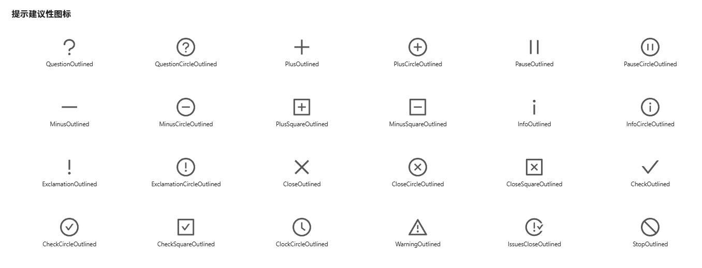
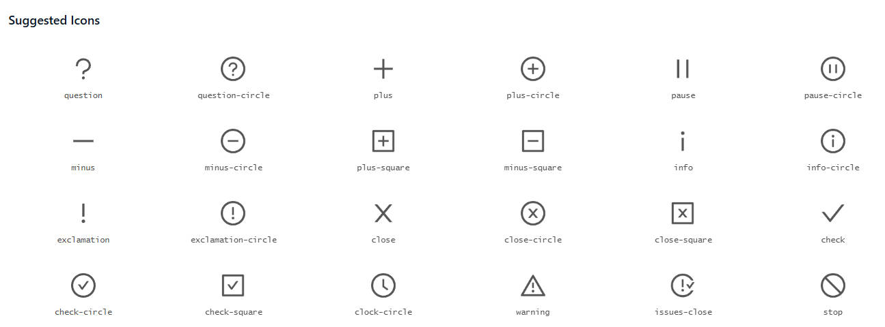
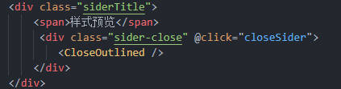
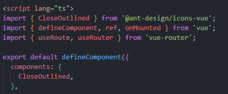

# Ant Design Vue中使用icon图标

[Ant-Design-Vue的icon官网](https://www.antdv.com/components/icon-cn/#-Icon)

使用前首先要安装组件包：

``` shell

npm install --save @ant-design/icons-vue
```

点击对应的图标，会自动将图标名称进行复制<SnippetsOutlined />

例如关闭：
``` html
<CloseOutlined />
```

<div align="center">
    
</div>


但不能直接使用！！！需要将所有大写字母改为小写，删除掉Oulined、TwoTone、Filled，并且中间-拼接snippets

调整为 <a-icon type="snippets" /> 就可以使用啦。

或者另一种可以直接使用的复制格式：
[Ant-design-vue的icon图标](https://1x.antdv.com/components/icon/#components-icon-demo-basic)
亲测有效！
复制格式：

``` html
<a-icon type="close" />
```

<div align="center">
    
</div>

进阶官方文档参考写法：

``` javascript

<template>
  <snippets-outlined :style="{font-size:'14px', color:'#666'}" />
</template>
<script>
  import { SnippetsOutlined } from '@ant-design/icons-vue';
  import { defineComponent } from 'vue';
  export default defineComponent({
    components: {
      SnippetsOutlined,
    },
  });
</script>
```

或者我的写法：

<div align="center">
    
</div>

<br>

<div align="center">
    
</div>


