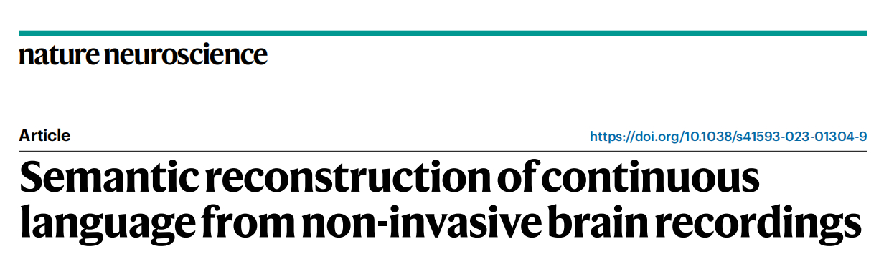
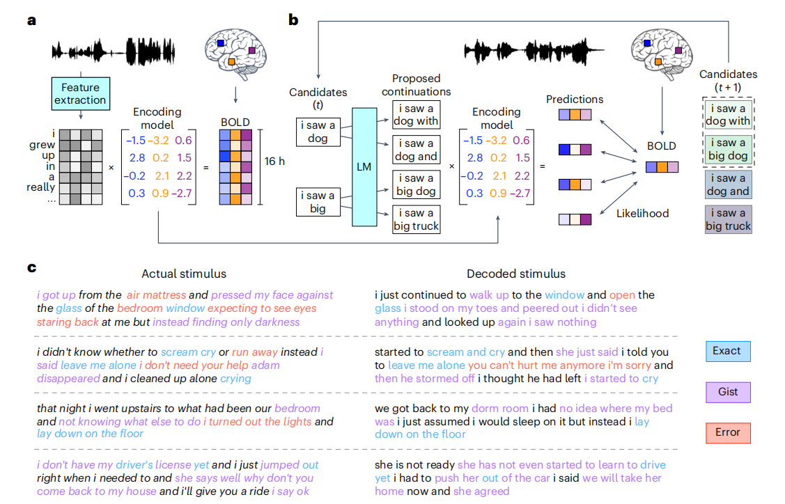

### 文章阅读记录-FMRI2TXT:非侵入性语言脑机接口

一篇在研一初期阅读到的文章，发表在《自然神经科学》杂志，它以一种“神奇的AI读心术”的形式，给我与朋友留下了深刻的印象。研二寒假闲暇，将它简单整理下来作以记录。

德克萨斯大学奥斯汀分校的研究者开发了一种基于GPT的语言解码器，它能通过非侵入性的MRI/fMRI收集大脑活动信息，并将思维转化为语言文字，准确率高达82%。这项技术有望为失去语言能力或无法外部沟通的人提供一种新的交流方式，同时也为认知神经科学和人工智能领域带来了新的突破。

    

#### 背景补充：

大脑解码技术可以通过不同的方法来实现。这其中主要分为三类：侵入式脑机接口，非侵入式脑机接口，以及用于研究神经元活动的大脑解码技术。

侵入式脑机接口是一种通过直接植入电极到大脑皮层来记录神经元活动的技术。它被广泛用于动物实验，可以帮助科学家们深入研究大脑的内部机制。

与侵入式脑机接口技术不同，非侵入式脑机接口技术不需要在大脑中植入电极，因此对于临床和人类研究而言更为安全。fMRI (功能性磁共振成像) 是一种常用的非侵入式脑机接口技术，它通过测量大脑中的血液流量变化来了解神经活动。EEG (脑电图) 和 MEG (脑磁图) 也是常用的非侵入式脑机接口技术，它们可以记录脑电活动和磁场活动。fNIRS (近红外光谱成像) 利用可见光外的红外光谱来研究脑血流量的变化。相比于侵入式脑机接口而言，这些非侵入式技术具有相对较低的信噪比，无法记录神经元活动的细节，但这仍然是理解大脑活动的有力工具。

fMRI是一种可以捕捉大脑在行为过程中血氧水平变化的技术，它可以反映出大脑不同区域的神经活动。通过fMRI，我们可以观察到大脑在听、说、想或看语言时所激活的区域和模式。

然而，fMRI也有一个很大的缺点，就是它的时间分辨率很低，也就是说它不能捕捉到快速变化的神经信号。对于自然语言（每秒超过两个词），这意味着每张fMRI图像可能受到20多个词的影响。因此，要从fMRI图像中还原出连续的语言，就需要解决一个不适定问题，即未知数比方程数多得多。

为了克服这个难题，德克萨斯大学奥斯汀分校的研究者利用了一个先进的AI语言模型——GPT-1。GPT是由OpenAI实验室开发的一个基于深度学习的文本生成系统，它可以根据给定的上下文生成连贯和流畅的自然语言。研究者将GPT与fMRI图像进行了训练和匹配，从而构建了一个语言解码器。

#### 实验设计：

    

首先，在实验前期，研究者让参与者在fMRI扫描仪中听或想一些故事，并记录下他们的大脑活动；

然后，在实验后期，研究者给出一些新的故事，并让参与者再次听或想，并记录下他们的大脑活动；

接着，研究者将这些新的大脑活动输入到语言解码器中，并让GPT生成多个可能与之对应的词序列；

最后，研究者通过比较GPT预测出来的大脑活动与实际记录下来的大脑活动之间的相似度，来选择最佳匹配的词序列作为输出。

研究者发现，这个语言解码器可以在不同任务和条件下都表现出较高的准确率和可靠性。

无论是听到、想象还是观看故事，语言解码器都可以生成与原始故事含义相近甚至相同的词序列。

例如，在听故事任务中，原始故事是“她把钱放进了她父亲以前用过并且现在已经坏掉了但她仍然保留着并且非常珍惜它并且把它放在床头柜上面那个小木盒子里”，而语言解码器输出是“她把钱放进了她父亲以前用过并且现在已经坏掉了但她仍然保留着并且非常珍惜它并且把它放在床头柜上面那个小盒子里”。

可以看出，输出与原始故事几乎完全相同，只有一个词（木）被省略了。

在想象故事任务中，原始故事是“我今天早上起床后去洗澡然后吃早饭然后去上班”，而语言解码器输出是“我今天早上起床后去洗澡然后吃早饭然后去工作”。

可以看出，输出与原始故事含义完全相同，只有一个词（工作）被替换了。

在观看故事任务中，原始故事是一个视频片段，内容是一个男孩在玩滑板时摔倒了，并被一个女孩帮助起来，并且两人开始交谈并走向公园里面 ，而语言解码器输出是“一个男孩在玩滑板时摔倒了，并被一个女孩帮助起来，并且两人开始聊天并走向公园”。

可以看出，输出与原始故事含义非常接近。

研究者还发现，在所有任务中，听故事任务表现最好（平均准确率82%），想象故事任务次之（平均准确率75%），观看故事任务最差（平均准确率63%）。

这可能是因为听故事任务中输入和输出都是自然语言形式，而观看故事任务中输入和输出之间存在跨媒体转换。

此外，在所有条件中， 主动合作条件表现最好（平均准确率79%），被动合作条件次之（平均准确率72%），主动反抗条件最差（平均准确率54%）。

这可能是因为主动合作条件中，参与者主动配合语言解码器的工作，而被动合作条件中，参与者只是被动地接受语言刺激，而主动反抗条件中，参与者故意分散注意力或想象与刺激无关的内容。这表明，语言解码器的效果受到参与者意愿和态度的影响。

这项研究是首次利用非侵入性的fMRI和基于GPT的AI语言模型来实现连续语言的解码，它为认知神经科学和人工智能领域带来了新的突破。

