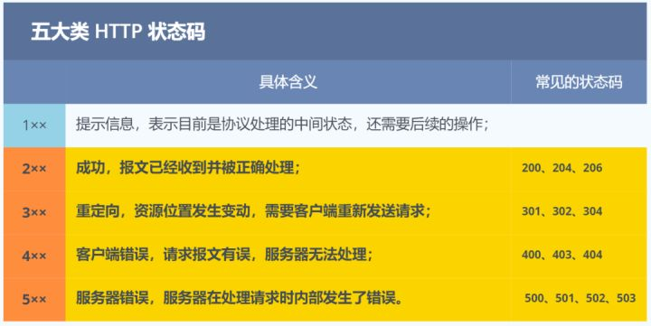
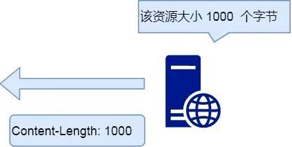
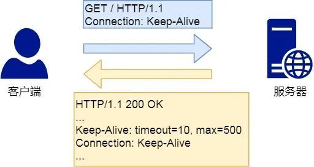
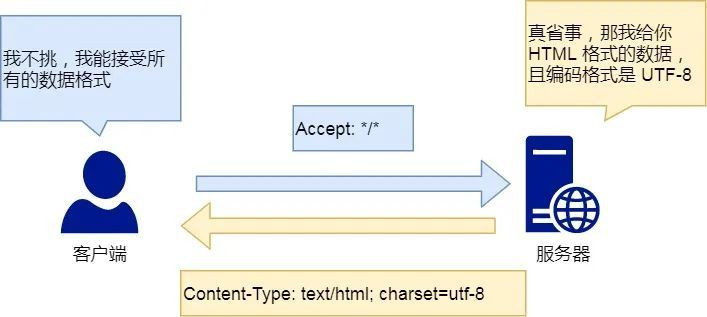
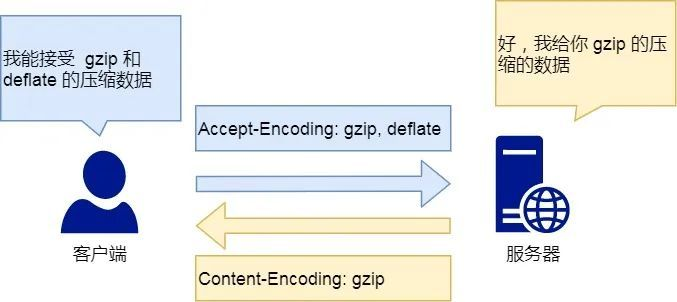

# HTTP常见面试题

## HTTP基本概念

[幕布链接](https://mubu.com/doc/4n-ehUovcCP)

1. HTTP 是什么？描述一下
- HTTP 是超文本传输协议，也就是HyperText Transfer Protocol。

2. 能否详细解释「超文本传输协议」？
- HTTP的名字「超文本协议传输」，HTTP 是一个在计算机世界里专门在「两点」之间「传输」文字、图片、音频、视频等「超文本」数据的「约定和规范」。

3. 那「HTTP 是用于从互联网服务器传输超文本到本地浏览器的协议HTTP」 ，这种说法正确吗？
- 这种说法是不正确的。因为也可以是「服务器< -- >服务器」，所以采用两点之间的描述会更准确。

4. HTTP 常见的状态码，有哪些？
- 1xx,2xx,3xx,4xx,5xx

    

- 1xx 类状态码属于提示信息，是协议处理中的一种中间状态，实际用到的比较少。
- 2xx 类状态码表示服务器成功处理了客户端的请求，也是我们最愿意看到的状态。
 「200 OK」是最常见的成功状态码，表示一切正常。如果是非 HEAD 请求，服务器返回的响应头都会有 body 数据。
 「204 No Content」也是常见的成功状态码，与 200 OK 基本相同，但响应头没有 body 数据。
 「206 Partial Content」是应用于 HTTP 分块下载或断电续传，表示响应返回的 body 数据并不是资源的全部，而是其中的一部分，也是服务器处理成功的状态。

- 3xx 类状态码表示客户端请求的资源发送了变动，需要客户端用新的 URL 重新发送请求获取资源，也就是重定向。
 「301 Moved Permanently」表示永久重定向，说明请求的资源已经不存在了，需改用新的 URL 再次访问。
 「302 Moved Permanently」表示临时重定向，说明请求的资源还在，但暂时需要用另一个 URL 来访问。
 301 和 302 都会在响应头里使用字段 Location，指明后续要跳转的 URL，浏览器会自动重定向新的 URL。
 「304 Not Modified」不具有跳转的含义，表示资源未修改，重定向已存在的缓冲文件，也称缓存重定向，用于缓存控制。

- 4xx 类状态码表示客户端发送的报文有误，服务器无法处理，也就是错误码的含义。
 「400 Bad Request」表示客户端请求的报文有错误，但只是个笼统的错误。
 「403 Forbidden」表示服务器禁止访问资源，并不是客户端的请求出错。
 「404 Not Found」表示请求的资源在服务器上不存在或未找到，所以无法提供给客户端。

- 5xx 类状态码表示客户端请求报文正确，但是服务器处理时内部发生了错误，属于服务器端的错误码。
  「500 Internal Server Error」与 400 类型，是个笼统通用的错误码，服务器发生了什么错误，我们并不知道。
 「501 Not Implemented」表示客户端请求的功能还不支持，类似“即将开业，敬请期待”的意思。
 「502 Bad Gateway」通常是服务器作为网关或代理时返回的错误码，表示服务器自身工作正常，访问后端服务器发生了错误。
 「503 Service Unavailable」表示服务器当前很忙，暂时无法响应服务器，类似“网络服务正忙，请稍后重试”的意思。

## http 常见字段有哪些？

1. Host
- 客户端发送请求时，用来指定服务器的域名。
- Host: http://www.A.com
- 有了 Host 字段，就可以将请求发往「同一台」服务器上的不同网站。

 

    

 

2. Content-Length 字段
- 服务器在返回数据时，会有 Content-Length 字段，表明本次回应的数据长度。
- Content-Length: 1000
- 如上面则是告诉浏览器，本次服务器回应的数据长度是 1000 个字节，后面的字节就属于下一个回应了。

 

    

 
3. Connection 字段
- Connection 字段最常用于客户端要求服务器使用 TCP 持久连接，以便其他请求复用。
- HTTP/1.1 版本的默认连接都是持久连接，但为了兼容老版本的 HTTP，需要指定 Connection 首部字段的值为 Keep-Alive。
- Connection: keep-alive
- 一个可以复用的 TCP 连接就建立了，直到客户端或服务器主动关闭连接。但是，这不是标准字段。

 

    

 

4. Content-Type 字段
- Content-Type 字段用于服务器回应时，告诉客户端，本次数据是什么格式。
- Content-Type: text/html; charset=utf-8
- 上面的类型表明，发送的是网页，而且编码是UTF-8。
- 客户端请求的时候，可以使用 Accept 字段声明自己可以接受哪些数据格式。
- Accept: */*
- 上面代码中，客户端声明自己可以接受任何格式的数据。

 

    

 

5. Content-Encoding 字段
- Content-Encoding 字段说明数据的压缩方法。表示服务器返回的数据使用了什么压缩格式
- Content-Encoding: gzip
- 下面表示服务器返回的数据采用了 gzip 方式压缩，告知客户端需要用此方式解压。
- 客户端在请求时，用 Accept-Encoding 字段说明自己可以接受哪些压缩方法。
- Accept-Encoding: gzip, deflate

 

    

 
