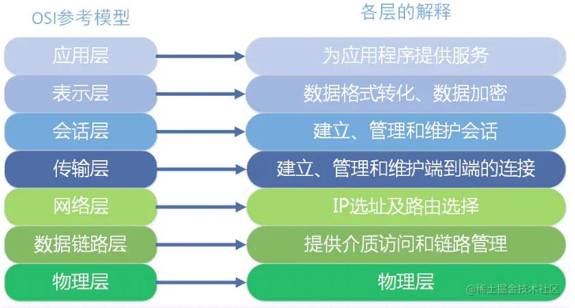
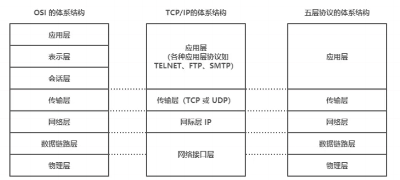
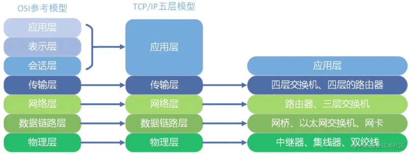
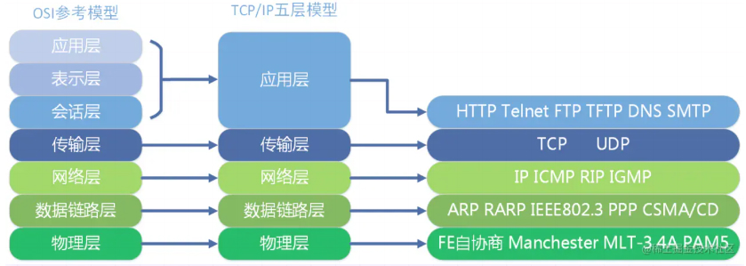
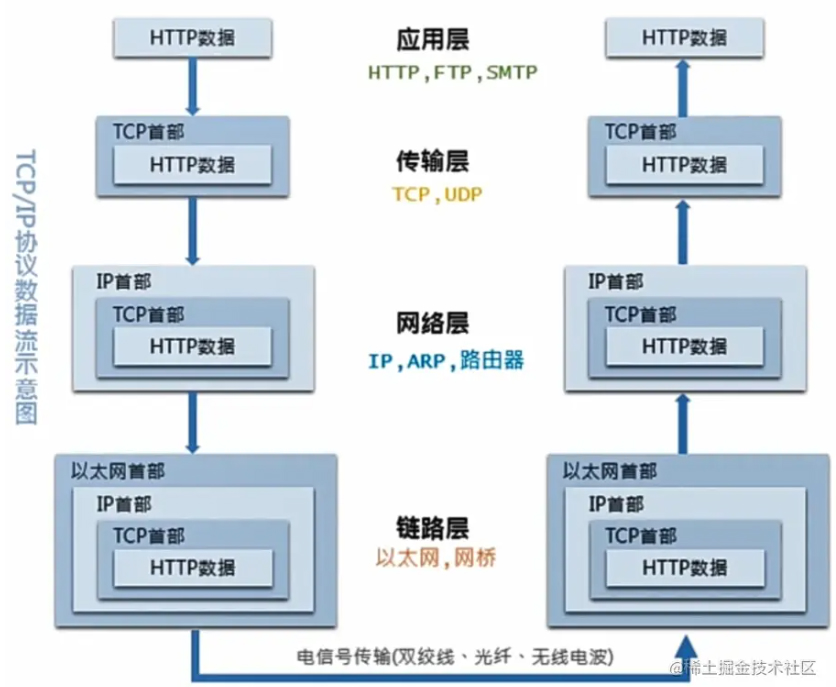
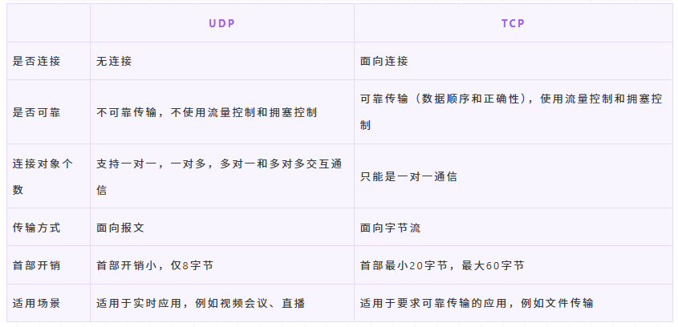
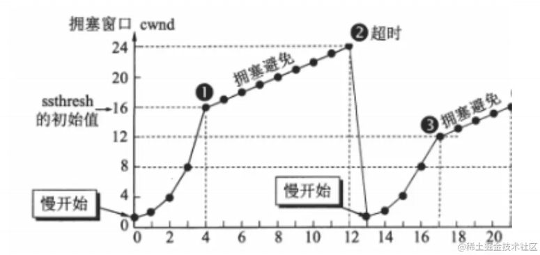
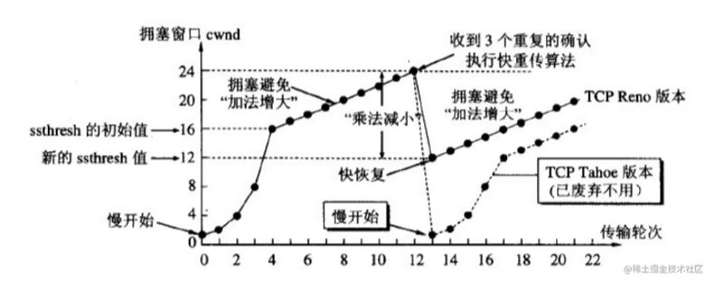
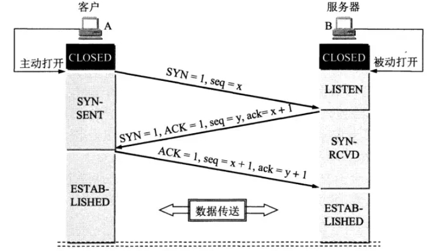
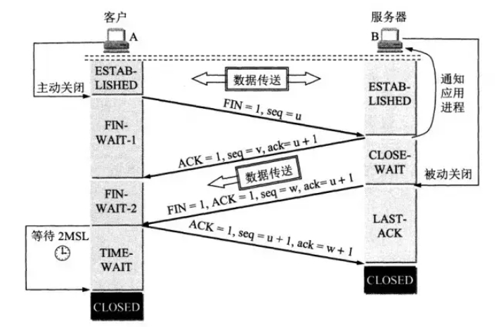

四、DNS协议介绍
1. DNS 协议是什么
概念： DNS 是域名系统 (Domain Name System) 的缩写，提供的是一种主机名到 IP 地址的转换服务，就是我们常说的域名系统。它是一个由分层的 DNS 服务器组成的分布式数据库，是定义了主机如何查询这个分布式数据库的方式的应用层协议。能够使人更方便的访问互联网，而不用去记住能够被机器直接读取的IP数串。
作用： 将域名解析为IP地址，客户端向DNS服务器（DNS服务器有自己的IP地址）发送域名查询请求，DNS服务器告知客户机Web服务器的 IP 地址。

2. DNS同时使用TCP和UDP协议？
DNS占用53号端口，同时使用TCP和UDP协议。
（1）在区域传输的时候使用TCP协议
- 辅域名服务器会定时（一般3小时）向主域名服务器进行查询以便了解数据是否有变动。如有变动，会执行一次区域传送，进行数据同步。区域传送使用TCP而不是UDP，因为数据同步传送的数据量比一个请求应答的数据量要多得多。
- TCP是一种可靠连接，保证了数据的准确性。
（2）在域名解析的时候使用UDP协议
- 客户端向DNS服务器查询域名，一般返回的内容都不超过512字节，用UDP传输即可。不用经过三次握手，这样DNS服务器负载更低，响应更快。理论上说，客户端也可以指定向DNS服务器查询时用TCP，但事实上，很多DNS服务器进行配置的时候，仅支持UDP查询包。

3. DNS完整的查询过程
DNS服务器解析域名的过程：
- 首先会在浏览器的缓存中查找对应的IP地址，如果查找到直接返回，若找不到继续下一步
- 将请求发送给本地DNS服务器，在本地域名服务器缓存中查询，如果查找到，就直接将查找结果返回，若找不到继续下一步
- 本地DNS服务器向根域名服务器发送请求，根域名服务器会返回一个所查询域的顶级域名服务器地址
- 本地DNS服务器向顶级域名服务器发送请求，接受请求的服务器查询自己的缓存，如果有记录，就返回查询结果，如果没有就返回相关的下一级的权威域名服务器的地址
- 本地DNS服务器向权威域名服务器发送请求，域名服务器返回对应的结果
- 本地DNS服务器将返回结果保存在缓存中，便于下次使用
- 本地DNS服务器将返回结果返回给浏览器
比如要查询 www.baidu.com 的 IP 地址，首先会在浏览器的缓存中查找是否有该域名的缓存，如果不存在就将请求发送到本地的 DNS 服务器中，本地DNS服务器会判断是否存在该域名的缓存，如果不存在，则向根域名服务器发送一个请求，根域名服务器返回负责 .com 的顶级域名服务器的 IP 地址的列表。然后本地 DNS 服务器再向其中一个负责 .com 的顶级域名服务器发送一个请求，负责 .com 的顶级域名服务器返回负责 .baidu 的权威域名服务器的 IP 地址列表。然后本地 DNS 服务器再向其中一个权威域名服务器发送一个请求，最后权威域名服务器返回一个对应的主机名的 IP 地址列表。

4. 迭代查询与递归查询
实际上，DNS解析是一个包含迭代查询和递归查询的过程。
- 递归查询指的是查询请求发出后，域名服务器代为向下一级域名服务器发出请求，最后向用户返回查询的最终结果。使用递归查询，**用户只需要发出一次查询请求**。
- 迭代查询指的是查询请求后，域名服务器返回单次查询的结果。下一级的查询由用户自己请求。使用迭代查询，**用户需要发出多次的查询请求**。
一般我们向本地 DNS 服务器发送请求的方式就是**递归查询**，因为我们只需要发出一次请求，然后本地 DNS 服务器返回给我们最终的请求结果。
而本地 DNS 服务器向其他域名服务器请求的过程是**迭代查询**的过程，因为每一次域名服务器只返回单次查询的结果，下一级的查询由本地 DNS 服务器自己进行。

5. DNS 记录和报文
DNS 服务器中以资源记录的形式存储信息，每一个 DNS 响应报文一般包含多条资源记录。一条资源记录的具体的格式为

``` javascript
（Name，Value，Type，TTL）
```

其中 TTL 是资源记录的生存时间，它定义了资源记录能够被其他的 DNS 服务器缓存多长时间。
常用的一共有四种 Type 的值，分别是 A、NS、CNAME 和 MX ，不同 Type 的值，对应资源记录代表的意义不同：
- 如果 Type = A，则 Name 是主机名，Value 是主机名对应的 IP 地址。因此一条记录为 A 的资源记录，提供了标 准的主机名到 IP 地址的映射。
- 如果 Type = NS，则 Name 是个域名，Value 是负责该域名的 DNS 服务器的主机名。这个记录主要用于 DNS 链式 查询时，返回下一级需要查询的 DNS 服务器的信息。
- 如果 Type = CNAME，则 Name 为别名，Value 为该主机的规范主机名。该条记录用于向查询的主机返回一个主机名 对应的规范主机名，从而告诉查询主机去查询这个主机名的 IP 地址。主机别名主要是为了通过给一些复杂的主机名提供 一个便于记忆的简单的别名。
- 如果 Type = MX，则 Name 为一个邮件服务器的别名，Value 为邮件服务器的规范主机名。它的作用和 CNAME 是一 样的，都是为了解决规范主机名不利于记忆的缺点。

### 五、网络模型

1. OSI七层模型
ISO为了更好的使网络应用更为普及，推出了OSI参考模型。

<div align="center">
    
</div>

（1）应用层
OSI参考模型中最靠近用户的一层，是为计算机用户提供应用接口，也为用户直接提供各种网络服务。
我们常见应用层的网络服务协议有：HTTP，HTTPS，FTP，POP3、SMTP等。
- 在客户端与服务器中经常会有数据的请求，这个时候就是会用到http(hyper text transfer protocol)(超文本传输协议)或者https.在后端设计数据接口时，我们常常使用到这个协议。
- FTP是文件传输协议，在开发过程中，个人并没有涉及到，但是我想，在一些资源网站，比如百度网盘``迅雷应该是基于此协议的。
- SMTP是simple mail transfer protocol（简单邮件传输协议）。在一个项目中，在用户邮箱验证码登录的功能时，使用到了这个协议。

（2）表示层
表示层提供各种用于应用层数据的编码和转换功能,确保一个系统的应用层发送的数据能被另一个系统的应用层识别。
如果必要，该层可提供一种标准表示形式，用于将计算机内部的多种数据格式转换成通信中采用的标准表示形式。数据压缩和加密也是表示层可提供的转换功能之一。
在项目开发中，为了方便数据传输，可以使用base64对数据进行编解码。如果按功能来划分，base64应该是工作在表示层。

（3）会话层
会话层就是负责建立、管理和终止表示层实体之间的通信会话。该层的通信由不同设备中的应用程序之间的服务请求和响应组成。

（4）传输层
传输层建立了主机端到端的链接，传输层的作用是为上层协议提供端到端的可靠和透明的数据传输服务，包括处理差错控制和流量控制等问题。该层向高层屏蔽了下层数据通信的细节，使高层用户看到的只是在两个传输实体间的一条主机到主机的、可由用户控制和设定的、可靠的数据通路。我们通常说的，TCP UDP就是在这一层。端口号既是这里的“端”。

（5）网络层
本层通过IP寻址来建立两个节点之间的连接，为源端的运输层送来的分组，选择合适的路由和交换节点，正确无误地按照地址传送给目的端的运输层。就是通常说的IP层。这一层就是我们经常说的IP协议层。IP协议是Internet的基础。我们可以这样理解，网络层规定了数据包的传输路线，而传输层则规定了数据包的传输方式。

（6）数据链路层
将比特组合成字节,再将字节组合成帧,使用链路层地址 (以太网使用MAC地址)来访问介质,并进行差错检测。网络层与数据链路层的对比，通过上面的描述，我们或许可以这样理解，网络层是规划了数据包的传输路线，而数据链路层就是传输路线。不过，在数据链路层上还增加了差错控制的功能。

（7）物理层
实际最终信号的传输是通过物理层实现的。通过物理介质传输比特流。规定了电平、速度和电缆针脚。常用设备有（各种物理设备）集线器、中继器、调制解调器、网线、双绞线、同轴电缆。这些都是物理层的传输介质。

OSI七层模型通信特点：对等通信 对等通信，为了使数据分组从源传送到目的地，源端OSI模型的每一层都必须与目的端的对等层进行通信，这种通信方式称为对等层通信。在每一层通信过程中，使用本层自己协议进行通信。

2. TCP/IP五层协议
TCP/IP五层协议和OSI的七层协议对应关系如下：

<div align="center">
    
</div>

- 应用层 (application layer)：直接为应用进程提供服务。应用层协议定义的是应用进程间通讯和交互的规则，不同的应用有着不同的应用层协议，如 HTTP协议（万维网服务）、FTP协议（文件传输）、SMTP协议（电子邮件）、DNS（域名查询）等。
- 传输层 (transport layer)：有时也译为运输层，它负责为两台主机中的进程提供通信服务。该层主要有以下两种协议：
 1. 传输控制协议 (Transmission Control Protocol，TCP)：提供面向连接的、可靠的数据传输服务，数据传输的基本单位是报文段（segment）；
 2. 用户数据报协议 (User Datagram Protocol，UDP)：提供无连接的、尽最大努力的数据传输服务，但不保证数据传输的可靠性，数据传输的基本单位是用户数据报。
 - 网络层 (internet layer)：有时也译为网际层，它负责为两台主机提供通信服务，并通过选择合适的路由将数据传递到目标主机。
 - 数据链路层 (data link layer)：负责将网络层交下来的 IP 数据报封装成帧，并在链路的两个相邻节点间传送帧，每一帧都包含数据和必要的控制信息（如同步信息、地址信息、差错控制等）。
 - 物理层 (physical Layer)：确保数据可以在各种物理媒介上进行传输，为数据的传输提供可靠的环境。

 **从上图中可以看出，TCP/IP模型比OSI模型更加简洁，它把应用层/表示层/会话层全部整合为了应用层。**

 在每一层都工作着不同的设备，比如我们常用的交换机就工作在数据链路层的，一般的路由器是工作在网络层的。

<div align="center">
    
</div>

在每一层实现的协议也各不同，即每一层的服务也不同，下图列出了每层主要的传输协议：

<div align="center">
    
</div>

同样，TCP/IP五层协议的通信方式也是对等通信：
<div align="center">
    
</div>

六、TCP与UDP

1. TCP 和 UDP的概念及特点
TCP 和 UDP都是传输层协议，他们都属于TCP/IP协议族：
（1）UDP
UDP的全称是用户数据报协议，在网络中它与TCP协议一样用于处理数据包，是一种无连接的协议。在OSI模型中，在传输层，处于IP协议的上一层。UDP有不提供数据包分组、组装和不能对数据包进行排序的缺点，也就是说，当报文发送之后，是无法得知其是否安全完整到达的。

它的特点如下：
1）面向无连接
首先 UDP 是不需要和 TCP一样在发送数据前进行三次握手建立连接的，想发数据就可以开始发送了。并且也只是数据报文的搬运工，不会对数据报文进行任何拆分和拼接操作。
具体来说就是：
- 在发送端，应用层将数据传递给传输层的 UDP 协议，UDP 只会给数据增加一个 UDP 头标识下是 UDP 协议，然后就传递给网络层了
- 在接收端，网络层将数据传递给传输层，UDP 只去除 IP 报文头就传递给应用层，不会任何拼接操作

2）有单播，多播，广播的功能
UDP 不止支持一对一的传输方式，同样支持一对多，多对多，多对一的方式，也就是说 UDP 提供了单播，多播，广播的功能。

3）面向报文
发送方的UDP对应用程序交下来的报文，在添加首部后就向下交付IP层。UDP对应用层交下来的报文，既不合并，也不拆分，而是保留这些报文的边界。因此，应用程序必须选择合适大小的报文

4）不可靠性
首先不可靠性体现在无连接上，通信都不需要建立连接，想发就发，这样的情况肯定不可靠。
并且收到什么数据就传递什么数据，并且也不会备份数据，发送数据也不会关心对方是否已经正确接收到数据了。
再者网络环境时好时坏，但是 UDP 因为没有拥塞控制，一直会以恒定的速度发送数据。即使网络条件不好，也不会对发送速率进行调整。这样实现的弊端就是在网络条件不好的情况下可能会导致丢包，但是优点也很明显，在某些实时性要求高的场景（比如电话会议）就需要使用 UDP 而不是 TCP。

5）头部开销小，传输数据报文时是很高效的。
UDP 头部包含了以下几个数据：
- 两个十六位的端口号，分别为源端口（可选字段）和目标端口
- 整个数据报文的长度
- 整个数据报文的检验和（IPv4 可选字段），该字段用于发现头部信息和数据中的错误
因此 UDP 的头部开销小，只有8字节，相比 TCP 的至少20字节要少得多，在传输数据报文时是很高效的。

（2）TCP TCP的全称是传输控制协议是一种面向连接的、可靠的、基于字节流的传输层通信协议。TCP 是面向连接的、可靠的流协议（流就是指不间断的数据结构）。

它有以下几个特点：
1）面向连接
面向连接，是指发送数据之前必须在两端建立连接。建立连接的方法是“三次握手”，这样能建立可靠的连接。建立连接，是为数据的可靠传输打下了基础。
2）仅支持单播传输
每条TCP传输连接只能有两个端点，只能进行点对点的数据传输，不支持多播和广播传输方式。
3）面向字节流
TCP不像UDP一样那样一个个报文独立地传输，而是在不保留报文边界的情况下以字节流方式进行传输。
4）可靠传输
对于可靠传输，判断丢包、误码靠的是TCP的段编号以及确认号。TCP为了保证报文传输的可靠，就给每个包一个序号，同时序号也保证了传送到接收端实体的包的按序接收。然后接收端实体对已成功收到的字节发回一个相应的确认(ACK)；如果发送端实体在合理的往返时延(RTT)内未收到确认，那么对应的数据（假设丢失了）将会被重传。
5）提供拥塞控制
当网络出现拥塞的时候，TCP能够减小向网络注入数据的速率和数量，缓解拥塞。
6）提供全双工通信
TCP允许通信双方的应用程序在任何时候都能发送数据，因为TCP连接的两端都设有缓存，用来临时存放双向通信的数据。当然，TCP可以立即发送一个数据段，也可以缓存一段时间以便一次发送更多的数据段（最大的数据段大小取决于MSS）

2. TCP和UDP的区别
<div align="center">
    
</div>

3. TCP和UDP的使用场景
- TCP应用场景： 效率要求相对低，但对准确性要求相对高的场景。因为传输中需要对数据确认、重发、排序等操作，相比之下效率没有UDP高。例如：文件传输（准确高要求高、但是速度可以相对慢）、接受邮件、远程登录。
- UDP应用场景： 效率要求相对高，对准确性要求相对低的场景。例如：QQ聊天、在线视频、网络语音电话（即时通讯，速度要求高，但是出现偶尔断续不是太大问题，并且此处完全不可以使用重发机制）、广播通信（广播、多播）。

4. UDP协议为什么不可靠？
UDP在传输数据之前不需要先建立连接，远地主机的运输层在接收到UDP报文后，不需要确认，提供不可靠交付。总结就以下四点：
- 不保证消息交付：不确认，不重传，无超时
- 不保证交付顺序：不设置包序号，不重排，不会发生队首阻塞
- 不跟踪连接状态：不必建立连接或重启状态机
- 不进行拥塞控制：不内置客户端或网络反馈机制

5. TCP的重传机制
由于TCP的下层网络（网络层）可能出现丢失、重复或失序的情况，TCP协议提供可靠数据传输服务。为保证数据传输的正确性，TCP会重传其认为已丢失（包括报文中的比特错误）的包。TCP使用两套独立的机制来完成重传，一是基于时间，二是基于确认信息。
TCP在发送一个数据之后，就开启一个定时器，若是在这个时间内没有收到发送数据的ACK确认报文，则对该报文进行重传，在达到一定次数还没有成功时放弃并发送一个复位信号。

6. TCP的拥塞控制机制
TCP的拥塞控制机制主要是以下四种机制：
- 慢启动（慢开始）
- 拥塞避免
- 快速重传
- 快速恢复

（1）慢启动（慢开始）
- 在开始发送的时候设置cwnd = 1（cwnd指的是拥塞窗口）
- 思路：开始的时候不要发送大量数据，而是先测试一下网络的拥塞程度，由小到大增加拥塞窗口的大小。
- 为了防止cwnd增长过大引起网络拥塞，设置一个慢开始门限(ssthresh 状态变量)
1. 当cwnd < ssthresh 时，使用慢开始算法
2. 当cnwd = ssthresh，既可使用慢开始算法，也可以使用拥塞避免算法
3. 当cwnd > ssthresh 时，使用拥塞避免算法

（2）拥塞避免
- 拥塞避免未必能够完全避免拥塞，是说在拥塞避免阶段将拥塞窗口控制为按线性增长，使网络不容易出现阻塞。
- 思路： 让拥塞窗口cwnd缓慢的增大，即每经过一个返回时间RTT就把发送方的拥塞控制窗口加一
- 无论是在慢开始阶段还是在拥塞避免阶段，只要发送方判断网络出现拥塞，就把慢开始门限设置为出现拥塞时的发送窗口大小的一半。然后把拥塞窗口设置为1，执行慢开始算法。如图所示:
<div align="center">
    
</div>
其中，判断网络出现拥塞的根据就是没有收到确认，虽然没有收到确认可能是其他原因的分组丢失，但是因为无法判定，所以都当做拥塞来处理。

（3）快速重传
- 快重传要求接收方在收到一个失序的报文段后就立即发出重复确认(为的是使发送方及早知道有报文段没有到达对方)。发送方只要连续收到三个重复确认就立即重传对方尚未收到的报文段，而不必继续等待设置的重传计时器时间到期。
- 由于不需要等待设置的重传计时器到期，能尽早重传未被确认的报文段，能提高整个网络的吞吐量

（4）快速恢复
- 当发送方连续收到三个重复确认时，就执行“乘法减小”算法，把ssthresh门限减半。但是接下去并不执行慢开始算法。
- 考虑到如果网络出现拥塞的话就不会收到好几个重复的确认，所以发送方现在认为网络可能没有出现拥塞。所以此时不执行慢开始算法，而是将cwnd设置为ssthresh的大小，然后执行拥塞避免算法。
<div align="center">
    
</div>

7. TCP的流量控制机制
一般来说，流量控制就是为了让发送方发送数据的速度不要太快，要让接收方来得及接收。TCP采用大小可变的滑动窗口进行流量控制，窗口大小的单位是字节。这里说的窗口大小其实就是每次传输的数据大小。
- 当一个连接建立时，连接的每一端分配一个缓冲区来保存输入的数据，并将缓冲区的大小发送给另一端。
- 当数据到达时，接收方发送确认，其中包含了自己剩余的缓冲区大小。（剩余的缓冲区空间的大小被称为窗口，指出窗口大小的通知称为窗口通告 。接收方在发送的每一确认中都含有一个窗口通告。）
- 如果接收方应用程序读数据的速度能够与数据到达的速度一样快，接收方将在每一确认中发送一个正的窗口通告。
- 如果发送方操作的速度快于接收方，接收到的数据最终将充满接收方的缓冲区，导致接收方通告一个零窗口 。发送方收到一个零窗口通告时，必须停止发送，直到接收方重新通告一个正的窗口。

8. TCP的可靠传输机制
TCP 的可靠传输机制是基于连续 ARQ 协议和滑动窗口协议的。
TCP 协议在发送方维持了一个发送窗口，发送窗口以前的报文段是已经发送并确认了的报文段，发送窗口中包含了已经发送但 未确认的报文段和允许发送但还未发送的报文段，发送窗口以后的报文段是缓存中还不允许发送的报文段。当发送方向接收方发 送报文时，会依次发送窗口内的所有报文段，并且设置一个定时器，这个定时器可以理解为是最早发送但未收到确认的报文段。 如果在定时器的时间内收到某一个报文段的确认回答，则滑动窗口，将窗口的首部向后滑动到确认报文段的后一个位置，此时如 果还有已发送但没有确认的报文段，则重新设置定时器，如果没有了则关闭定时器。如果定时器超时，则重新发送所有已经发送 但还未收到确认的报文段，并将超时的间隔设置为以前的两倍。当发送方收到接收方的三个冗余的确认应答后，这是一种指示， 说明该报文段以后的报文段很有可能发生丢失了，那么发送方会启用快速重传的机制，就是当前定时器结束前，发送所有的已发 送但确认的报文段。

接收方使用的是累计确认的机制，对于所有按序到达的报文段，接收方返回一个报文段的肯定回答。如果收到了一个乱序的报文 段，那么接方会直接丢弃，并返回一个最近的按序到达的报文段的肯定回答。使用累计确认保证了返回的确认号之前的报文段都 已经按序到达了，所以发送窗口可以移动到已确认报文段的后面。

发送窗口的大小是变化的，它是由接收窗口剩余大小和网络中拥塞程度来决定的，TCP 就是通过控制发送窗口的长度来控制报文 段的发送速率。

但是 TCP 协议并不完全和滑动窗口协议相同，因为许多的 TCP 实现会将失序的报文段给缓存起来，并且发生重传时，只会重 传一个报文段，因此 TCP 协议的可靠传输机制更像是窗口滑动协议和选择重传协议的一个混合体。

9. TCP的三次握手和四次挥手
（1）三次握手
<div align="center">
    
</div>
（Three-way Handshake）其实就是指建立一个TCP连接时，需要客户端和服务器总共发送3个包。进行三次握手的主要作用就是为了确认双方的接收能力和发送能力是否正常、指定自己的初始化序列号为后面的可靠性传送做准备。实质上其实就是连接服务器指定端口，建立TCP连接，并同步连接双方的序列号和确认号，交换TCP窗口大小信息。

刚开始客户端处于 Closed 的状态，服务端处于 Listen 状态。
- 第一次握手：客户端给服务端发一个 SYN 报文，并指明客户端的初始化序列号 ISN，此时客户端处于 SYN_SEND 状态。

**首部的同步位SYN=1，初始序号seq=x，SYN=1的报文段不能携带数据，但要消耗掉一个序号。**

- 第二次握手：服务器收到客户端的 SYN 报文之后，会以自己的 SYN 报文作为应答，并且也是指定了自己的初始化序列号 ISN。同时会把客户端的 ISN + 1 作为ACK 的值，表示自己已经收到了客户端的 SYN，此时服务器处于 SYN_REVD 的状态。

**在确认报文段中SYN=1，ACK=1，确认号ack=x+1，初始序号seq=y**

- 第三次握手：客户端收到 SYN 报文之后，会发送一个 ACK 报文，当然，也是一样把服务器的 ISN + 1 作为 ACK 的值，表示已经收到了服务端的 SYN 报文，此时客户端处于 ESTABLISHED 状态。服务器收到 ACK 报文之后，也处于 ESTABLISHED 状态，此时，双方已建立起了连接。

**确认报文段ACK=1，确认号ack=y+1，序号seq=x+1（初始为seq=x，第二个报文段所以要+1），ACK报文段可以携带数据，不携带数据则不消耗序号。**

那为什么要三次握手呢？两次不行吗？
- 为了确认双方的接收能力和发送能力都正常
- 如果是用两次握手，则会出现下面这种情况：

**如客户端发出连接请求，但因连接请求报文丢失而未收到确认，于是客户端再重传一次连接请求。后来收到了确认，建立了连接。数据传输完毕后，就释放了连接，客户端共发出了两个连接请求报文段，其中第一个丢失，第二个到达了服务端，但是第一个丢失的报文段只是在某些网络结点长时间滞留了，延误到连接释放以后的某个时间才到达服务端，此时服务端误认为客户端又发出一次新的连接请求，于是就向客户端发出确认报文段，同意建立连接，不采用三次握手，只要服务端发出确认，就建立新的连接了，此时客户端忽略服务端发来的确认，也不发送数据，则服务端一致等待客户端发送数据，浪费资源。**

简单来说就是以下三步：
- 第一次握手： 客户端向服务端发送连接请求报文段。该报文段中包含自身的数据通讯初始序号。请求发送后，客户端便进入 SYN-SENT 状态。
- 第二次握手： 服务端收到连接请求报文段后，如果同意连接，则会发送一个应答，该应答中也会包含自身的数据通讯初始序号，发送完成后便进入 SYN-RECEIVED 状态。
- 第三次握手： 当客户端收到连接同意的应答后，还要向服务端发送一个确认报文。客户端发完这个报文段后便进入 ESTABLISHED 状态，服务端收到这个应答后也进入 ESTABLISHED 状态，此时连接建立成功。

TCP 三次握手的建立连接的过程就是相互确认初始序号的过程，告诉对方，什么样序号的报文段能够被正确接收。 第三次握手的作用是客户端对服务器端的初始序号的确认。如果只使用两次握手，那么服务器就没有办法知道自己的序号是否 已被确认。同时这样也是为了防止失效的请求报文段被服务器接收，而出现错误的情况。

（2）四次挥手
<div align="center">
    
</div>

刚开始方都处于 ESTABLISHED 状态，假如是客户端先发起关闭请求。四次挥手的过程如下：
- 第一次挥手： 客户端会发送一个 FIN 报文，报文中会指定一个序列号。此时客户端处于 FIN_WAIT1 状态。
即发出连接释放报文段（FIN=1，序号seq=u），并停止再发送数据，主动关闭TCP连接，进入FIN_WAIT1（终止等待1）状态，等待服务端的确认。

- 第二次挥手：服务端收到 FIN 之后，会发送 ACK 报文，且把客户端的序列号值 +1 作为 ACK 报文的序列号值，表明已经收到客户端的报文了，此时服务端处于 CLOSE_WAIT 状态。

即服务端收到连接释放报文段后即发出确认报文段（ACK=1，确认号ack=u+1，序号seq=v），服务端进入CLOSE_WAIT（关闭等待）状态，此时的TCP处于半关闭状态，客户端到服务端的连接释放。客户端收到服务端的确认后，进入FIN_WAIT2（终止等待2）状态，等待服务端发出的连接释放报文段。

- 第三次挥手：如果服务端也想断开连接了，和客户端的第一次挥手一样，发给 FIN 报文，且指定一个序列号。此时服务端处于 LAST_ACK 的状态。
即服务端没有要向客户端发出的数据，服务端发出连接释放报文段（FIN=1，ACK=1，序号seq=w，确认号ack=u+1），服务端进入LAST_ACK（最后确认）状态，等待客户端的确认。

- 第四次挥手：客户端收到 FIN 之后，一样发送一个 ACK 报文作为应答，且把服务端的序列号值 +1 作为自己 ACK 报文的序列号值，此时客户端处于 TIME_WAIT 状态。需要过一阵子以确保服务端收到自己的 ACK 报文之后才会进入 CLOSED 状态，服务端收到 ACK 报文之后，就处于关闭连接了，处于 CLOSED 状态。

即客户端收到服务端的连接释放报文段后，对此发出确认报文段（ACK=1，seq=u+1，ack=w+1），客户端进入TIME_WAIT（时间等待）状态。此时TCP未释放掉，需要经过时间等待计时器设置的时间2MSL后，客户端才进入CLOSED状态。

那为什么需要四次挥手呢？
因为当服务端收到客户端的SYN连接请求报文后，可以直接发送SYN+ACK报文。其中ACK报文是用来应答的，SYN报文是用来同步的。但是关闭连接时，当服务端收到FIN报文时，很可能并不会立即关闭SOCKET，所以只能先回复一个ACK报文，告诉客户端，“你发的FIN报文我收到了”。只有等到我服务端所有的报文都发送完了，我才能发送FIN报文，因此不能一起发送，故需要四次挥手。

简单来说就是以下四步：
- 第一次挥手： 若客户端认为数据发送完成，则它需要向服务端发送连接释放请求。
- 第二次挥手：服务端收到连接释放请求后，会告诉应用层要释放 TCP 链接。然后会发送 ACK 包，并进入 CLOSE_WAIT 状态，此时表明客户端到服务端的连接已经释放，不再接收客户端发的数据了。但是因为 TCP 连接是双向的，所以服务端仍旧可以发送数据给客户端。
- 第三次挥手：服务端如果此时还有没发完的数据会继续发送，完毕后会向客户端发送连接释放请求，然后服务端便进入 LAST-ACK 状态。
- 第四次挥手： 客户端收到释放请求后，向服务端发送确认应答，此时客户端进入 TIME-WAIT 状态。该状态会持续 2MSL（最大段生存期，指报文段在网络中生存的时间，超时会被抛弃） 时间，若该时间段内没有服务端的重发请求的话，就进入 CLOSED 状态。当服务端收到确认应答后，也便进入 CLOSED 状态。

TCP 使用四次挥手的原因是因为 TCP 的连接是全双工的，所以需要双方分别释放到对方的连接，单独一方的连接释放，只代 表不能再向对方发送数据，连接处于的是半释放的状态。
最后一次挥手中，客户端会等待一段时间再关闭的原因，是为了防止发送给服务器的确认报文段丢失或者出错，从而导致服务器 端不能正常关闭。

10. TCP粘包是怎么回事，如何处理?
默认情况下, TCP 连接会启⽤延迟传送算法 (Nagle 算法), 在数据发送之前缓存他们. 如果短时间有多个数据发送, 会缓冲到⼀起作⼀次发送 (缓冲⼤⼩⻅ socket.bufferSize ), 这样可以减少 IO 消耗提⾼性能.
如果是传输⽂件的话, 那么根本不⽤处理粘包的问题, 来⼀个包拼⼀个包就好了。但是如果是多条消息, 或者是别的⽤途的数据那么就需要处理粘包.
下面看⼀个例⼦, 连续调⽤两次 send 分别发送两段数据 data1 和 data2, 在接收端有以下⼏种常⻅的情况:
A. 先接收到 data1, 然后接收到 data2 .
B. 先接收到 data1 的部分数据, 然后接收到 data1 余下的部分以及 data2 的全部.
C. 先接收到了 data1 的全部数据和 data2 的部分数据, 然后接收到了 data2 的余下的数据.
D. ⼀次性接收到了 data1 和 data2 的全部数据.

其中的 BCD 就是我们常⻅的粘包的情况. ⽽对于处理粘包的问题, 常⻅的解决⽅案有:
- 多次发送之前间隔⼀个等待时间：只需要等上⼀段时间再进⾏下⼀次 send 就好, 适⽤于交互频率特别低的场景. 缺点也很明显, 对于⽐较频繁的场景⽽⾔传输效率实在太低，不过⼏乎不⽤做什么处理.
- 关闭 Nagle 算法：关闭 Nagle 算法, 在 Node.js 中你可以通过 socket.setNoDelay() ⽅法来关闭 Nagle 算法, 让每⼀次 send 都不缓冲直接发送。该⽅法⽐较适⽤于每次发送的数据都⽐较⼤ (但不是⽂件那么⼤), 并且频率不是特别⾼的场景。如果是每次发送的数据量⽐较⼩, 并且频率特别⾼的, 关闭 Nagle 纯属⾃废武功。另外, 该⽅法不适⽤于⽹络较差的情况, 因为 Nagle 算法是在服务端进⾏的包合并情况, 但是如果短时间内客户端的⽹络情况不好, 或者应⽤层由于某些原因不能及时将 TCP 的数据 recv, 就会造成多个包在客户端缓冲从⽽粘包的情况。 (如果是在稳定的机房内部通信那么这个概率是⽐较⼩可以选择忽略的)
- 进⾏封包/拆包： 封包/拆包是⽬前业内常⻅的解决⽅案了。即给每个数据包在发送之前, 于其前/后放⼀些有特征的数据, 然后收到数据的时 候根据特征数据分割出来各个数据包。

11. 为什么udp不会粘包？
- TCP协议是⾯向**流**的协议，UDP是⾯向**消息**的协议。UDP段都是⼀条消息，应⽤程序必须以消息为单位提取数据，不能⼀次提取任意字节的数据
- UDP具有保护消息边界，在每个UDP包中就有了消息头（消息来源地址，端⼝等信息），这样对于接收端来说就容易进⾏区分处理了。传输协议把数据当作⼀条独⽴的消息在⽹上传输，接收端只能接收独⽴的消息。接收端⼀次只能接收发送端发出的⼀个数据包,如果⼀次接受数据的⼤⼩⼩于发送端⼀次发送的数据⼤⼩，就会丢失⼀部分数据，即使丢失，接受端也不会分两次去接收。

七、WebSocket
1. 对 WebSocket 的理解
WebSocket是HTML5提供的一种浏览器与服务器进行全双工通讯的网络技术，属于应用层协议。它基于TCP传输协议，并复用HTTP的握手通道。浏览器和服务器只需要完成一次握手，两者之间就直接可以创建持久性的连接， 并进行双向数据传输。

WebSocket 的出现就解决了半双工通信的弊端。它最大的特点是：服务器可以向客户端主动推动消息，客户端也可以主动向服务器推送消息。

WebSocket原理：客户端向 WebSocket 服务器通知（notify）一个带有所有接收者ID（recipients IDs）的事件（event），服务器接收后立即通知所有活跃的（active）客户端，只有ID在接收者ID序列中的客户端才会处理这个事件。
​

WebSocket 特点的如下：
- 支持双向通信，实时性更强
- 可以发送文本，也可以发送二进制数据‘’
- 建立在TCP协议之上，服务端的实现比较容易
- 数据格式比较轻量，性能开销小，通信高效
- 没有同源限制，客户端可以与任意服务器通信
- 协议标识符是ws（如果加密，则为wss），服务器网址就是 URL
- 与 HTTP 协议有着良好的兼容性。默认端口也是80和443，并且握手阶段采用 HTTP 协议，因此握手时不容易屏蔽，能通过各种 HTTP 代理服务器。

Websocket的使用方法如下：​

在客户端中：

``` javascript
// 在index.html中直接写WebSocket，设置服务端的端口号为 9999
let ws = new WebSocket('ws://localhost:9999');
// 在客户端与服务端建立连接后触发
ws.onopen = function() {
    console.log("Connection open."); 
    ws.send('hello');
};
// 在服务端给客户端发来消息的时候触发
ws.onmessage = function(res) {
    console.log(res);       // 打印的是MessageEvent对象
    console.log(res.data);  // 打印的是收到的消息
};
// 在客户端与服务端建立关闭后触发
ws.onclose = function(evt) {
  console.log("Connection closed.");
}; 

```

2. 即时通讯的实现：短轮询、长轮询、SSE 和 WebSocket 间的区别？

短轮询和长轮询的目的都是用于实现客户端和服务器端的一个即时通讯。

短轮询的基本思路： 浏览器每隔一段时间向浏览器发送 http 请求，服务器端在收到请求后，不论是否有数据更新，都直接进行响应。这种方式实现的即时通信，本质上还是浏览器发送请求，服务器接受请求的一个过程，通过让客户端不断的进行请求，使得客户端能够模拟实时地收到服务器端的数据的变化。这种方式的优点是比较简单，易于理解。缺点是这种方式由于需要不断的建立 http 连接，严重浪费了服务器端和客户端的资源。当用户增加时，服务器端的压力就会变大，这是很不合理的。

长轮询的基本思路： 首先由客户端向服务器发起请求，当服务器收到客户端发来的请求后，服务器端不会直接进行响应，而是先将这个请求挂起，然后判断服务器端数据是否有更新。如果有更新，则进行响应，如果一直没有数据，则到达一定的时间限制才返回。客户端 JavaScript 响应处理函数会在处理完服务器返回的信息后，再次发出请求，重新建立连接。长轮询和短轮询比起来，它的优点是明显减少了很多不必要的 http 请求次数，相比之下节约了资源。长轮询的缺点在于，连接挂起也会导致资源的浪费。

SSE 的基本思想： 服务器使用流信息向服务器推送信息。严格地说，http 协议无法做到服务器主动推送信息。但是，有一种变通方法，就是服务器向客户端声明，接下来要发送的是流信息。也就是说，发送的不是一次性的数据包，而是一个数据流，会连续不断地发送过来。这时，客户端不会关闭连接，会一直等着服务器发过来的新的数据流，视频播放就是这样的例子。SSE 就是利用这种机制，使用流信息向浏览器推送信息。它基于 http 协议，目前除了 IE/Edge，其他浏览器都支持。它相对于前面两种方式来说，不需要建立过多的 http 请求，相比之下节约了资源。

WebSocket 是 HTML5 定义的一个新协议议，与传统的 http 协议不同，该协议允许由服务器主动的向客户端推送信息。使用 WebSocket 协议的缺点是在服务器端的配置比较复杂。WebSocket 是一个全双工的协议，也就是通信双方是平等的，可以相互发送消息，而 SSE 的方式是单向通信的，只能由服务器端向客户端推送信息，如果客户端需要发送信息就是属于下一个 http 请求了。

上面的四个通信协议，前三个都是基于HTTP协议的。

对于这四种即使通信协议，从性能的角度来看：
WebSocket > 长连接（SEE） > 长轮询 > 短轮询
但是，我们如果考虑浏览器的兼容性问题，顺序就恰恰相反了：
短轮询 > 长轮询 > 长连接（SEE） > WebSocket
所以，还是要根据具体的使用场景来判断使用哪种方式。

