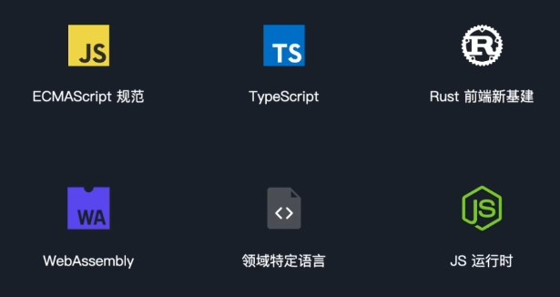

## 编程语言、ES标准、JS引擎和运行时

JavaScript是前端使用频率最高的编程语言，用它配合HTML和CSS足以构建出一个完整的Web应用

但是在现代前端，除了JS还会涉及到许多别的编程语言，它们各有所长
 

    

 

我们经常提到ES6，它的全称是ECMAScript 6或是ECMAScript 2015，它是一套文档，规范了脚本语言的设计，包括语法、数据类型、内置对象等等，而JS则是遵循这套规范的编程语言之一，ES规范确保了无论在何处使用JS，它的写法和行为都应该是一致的。

ES规范每年引入一些新特性，从ES2015的let/const、箭头函数，到ES2024的Object.groupBy，已经加入了非常多实用的功能。

借助于现代前端工具链的转义和polyfills的等效实现，你可以在不支持这些新特性的环境中使用它们。

TypeScript是JavaScript的超集，正如其名，它的核心特性是类型系统。

类型系统有许多优势，即便没有写TypeScript，你依然在享受类型系统带来的便利，比如VSCocde提供的类型提示就是基于TypeScript类型的。

TypeScript最终依然会编译到JavaScript，但在大型前端应用中，TypeScript的类型检查可以使许多常见错误暴露于编译阶段，从而减少运行时错误，极大地提升了代码的健壮性和可维护性，因此，使用TypeScript开发高质量前端应用几乎是必须的。

近些年Rust在前端发展十分迅猛，它正在占领前端工具链生态，比较典型的案例有：对标Babel的SWC、对标Webpack的Rspack、Farm，Next.js的Turbopack等都是基于Rust语言编写的，这里最根本的原因是前端项目的体量越来越庞大，构建性能已经成为瓶颈，传统的打包优化方案已经无法进一步提升性能，因此需要借助性能更强的编程语言，它就是Rust。

Rust:兼顾性能、安全和稳定的现代编程语言。与其说Rust占领了前端基建，不如说它是好刀用到了刀刃上。

WebAssembly简称Wasm，最早用于在浏览器中处理计算密集型任务，而到了现代，它已然成为一套完整的应用运行生态。它通常不由人直接编写，而是系统语言C/C++/Go和Rust的编译目标之一。

Wasm Runtime的出现使其能在非浏览器环境中运行，比如我们可以直接在Node.js中运行Wasm。

WebAssembly System Interface（WASI）API，又为Wasm提供了访问系统功能的能力，比如文件系统和网络等。

Wasm在Web开发中有着广泛的应用，除了满足重度计算需求外，它还应用于跨平台开发、安全沙箱、容器和虚拟化技术。

你也许使用过在浏览器中打开的云IDE，它就是Wasm落地应用的集大成者，还有一类编程语言称之为领域特定语言（DSL），它通常是某个现有语言基础上，增加一定约束和扩展，应用于某个特定场景。

比如我们在微信小程序中编写的WXML、在React中编写的JSX、在Vue中编写的Template等等，它们都统称领域特定语言。领域特定语言并不是通用型语言，但相比通用型语言，它的语法更简单、开发效率更高、专业对口业务、可维护性强。

你写的代码要运行，自然离不开JS引擎和JS运行时，JS引擎负责代码解析、编译、执行和优化，而JS运行时不仅自带一个JS引擎，还提供了一组环境相关的API，比如服务端的Node.js，是基于V8的运行时，而Bun则是基于JavaScriptCore的运行时，它们提供了不同的API。

比如同样是打开文件，Node.js是fs.open()，而Bun则是Bun.file()，再比如Chrome浏览器提供了基于V8引擎的运行时，而Safari浏览器提供了基于JavaScriptCore引擎的运行时，它们都提供了Web API，但实现上有着细微差异。这也是客户端代码容易产生兼容性问题的根本原因。

又比如Next.js提供的边缘运行时，不支持Node.js API;
而Cloudflare云服务的边缘环境则支持有限的Node.js API，因此，前端开发者需要分清楚自己的代码会在什么样的运行时中运行，我们已经知道Node.js是最常用的JS运行时，但在企业级的大型Node.js应用中，仅仅用它还是不够的。大型Node.js应用，还会考虑性能监控、安全提醒、故障排除、性能优化等问题，比如阿里云前端基建团队的Node.js性能平台（前身叫alinode），就在Node.js的基础上增加了这些功能，提供了一整套解决方案。