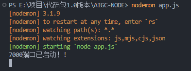
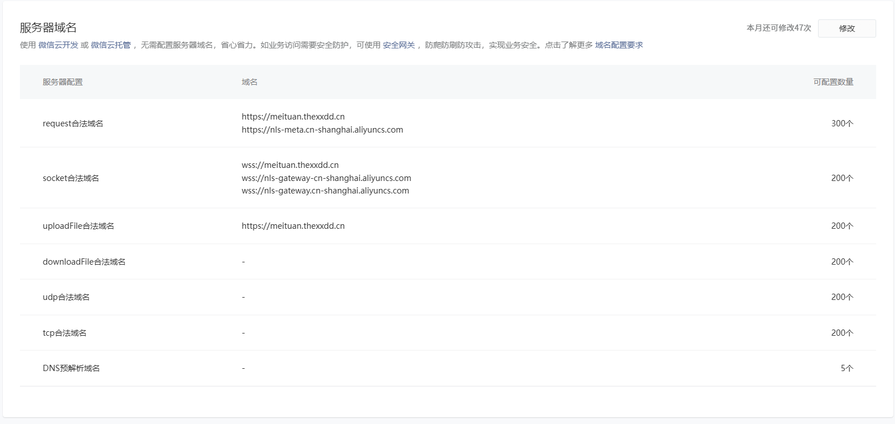
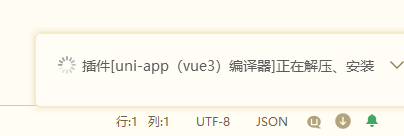
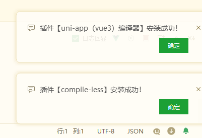
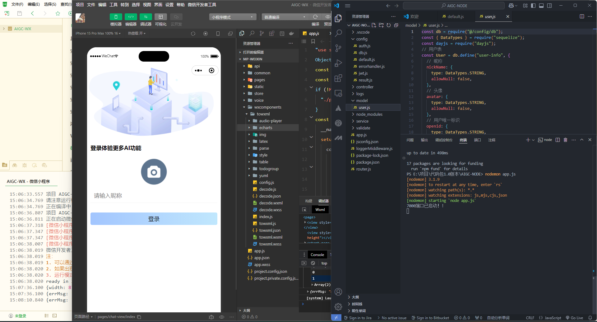
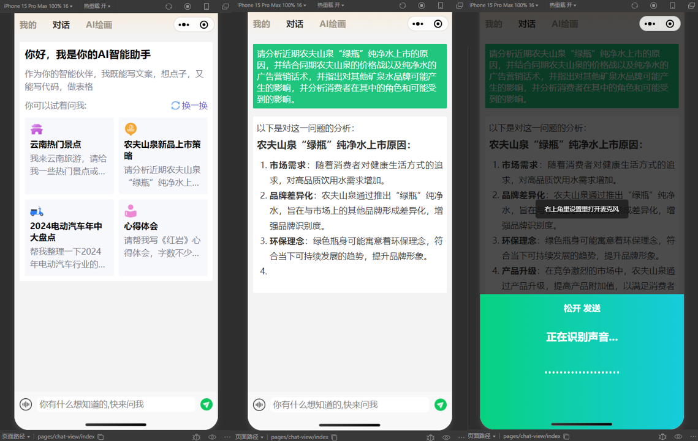

### 基于vue框架+uniapp的微信小程序开发配置教程帖

运行教程

- 后端
- 跨端启动
- 小程序端


#### 后端-基于Node.js，IDE：VScode

配置数据库：

数据库：MySQL、Redis

数据库管理工具：SQLynx、TinyRDM


配置大模型api：

注册并配置智谱清言和阿里云实时语音识别产品的AccessKey和对应密钥


安装依赖并运行：

```bash
npm install 
nodemon app.js
```

得到如下输出说明启动成功：

<div align="center">
    
</div>


#### 微信小程序端-微信公众平台、微信开发者工具

注册微信小程序，配置appID和密钥；在阿里云创建智能语音交互项目，并将第三方服务器域名配置在微信小程序的服务器域名配置栏，同时配置图床url：


<div align="center">
    
</div>


#### 跨端启动-HBuilderX

将微信小程序端代码拖入HBuilderX，通过ipconfig查看自己的IPv4地址为项目配置baseURL

通过uni-app实现跨端，在mainfest.json配置对应的微信小程序appID，选择运行到小程序模拟器-微信开发者工具，自动启动微信开发者工具编译项目。

<div align="center">
    
</div>


<div align="center">
    
</div>


项目最终在微信开发者工具中呈现。

注意：设置微信开发者工具为没有代理、开启服务端口；在右侧点击“详情”查看配置，在本地配置下勾选不校验合法域名；注意appID一定要和vscode以及HBuilderX中配置的appID是一致的。


<div align="center">
    
</div>

<div align="center">
    
</div>

撒花！！！