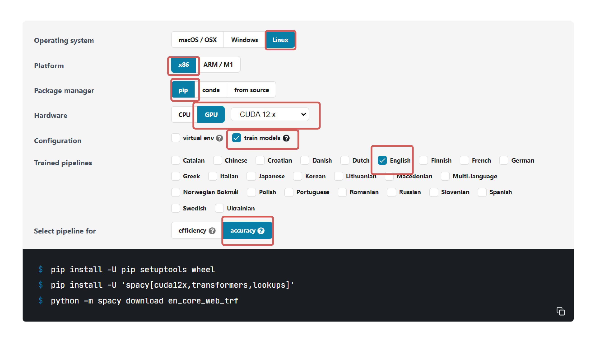
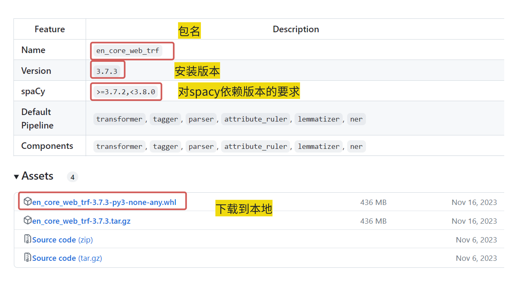
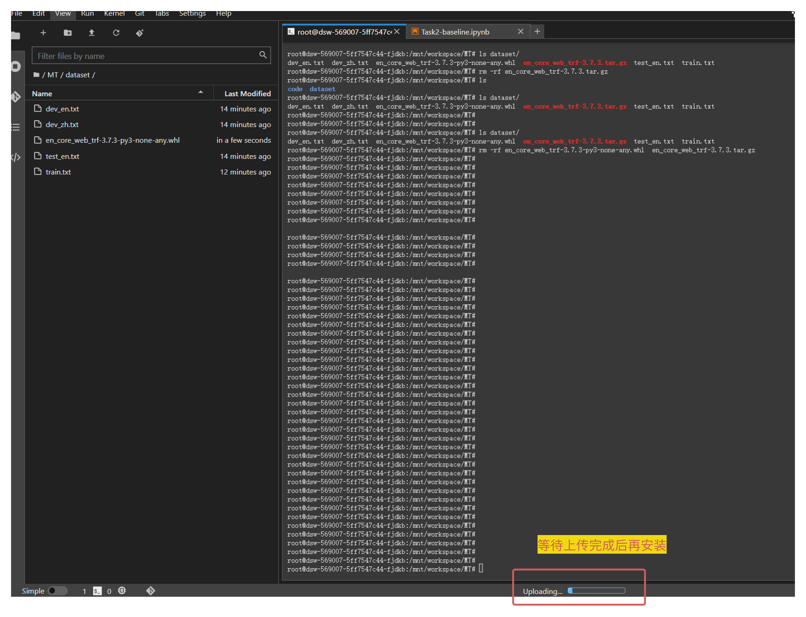
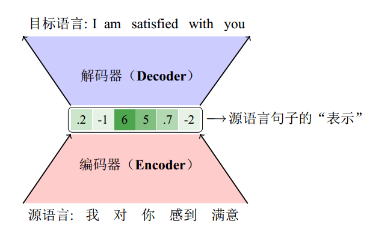
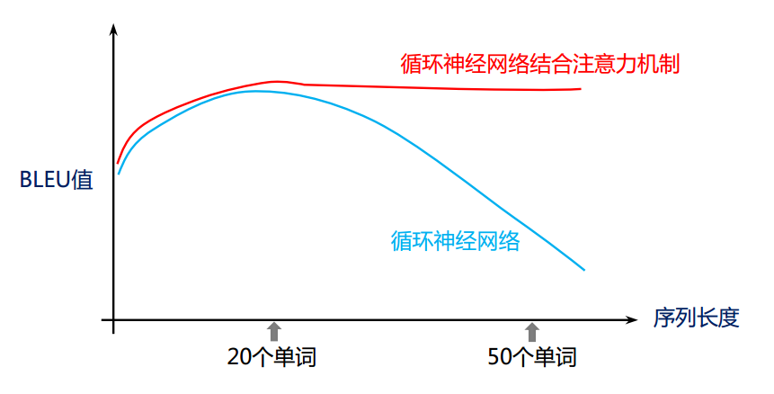
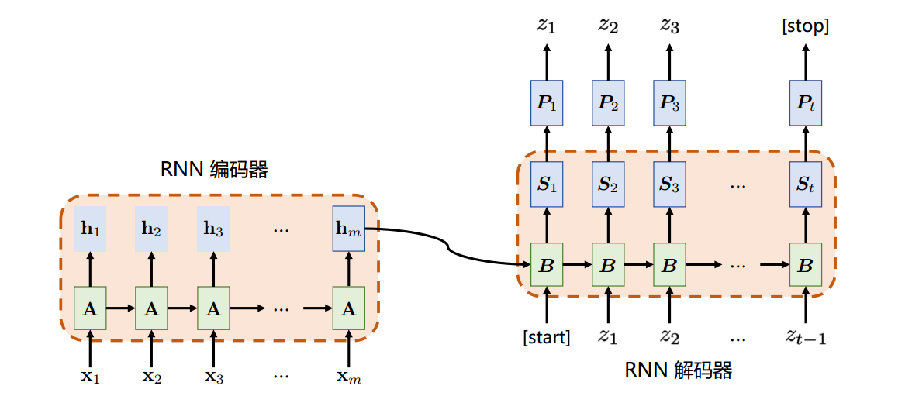
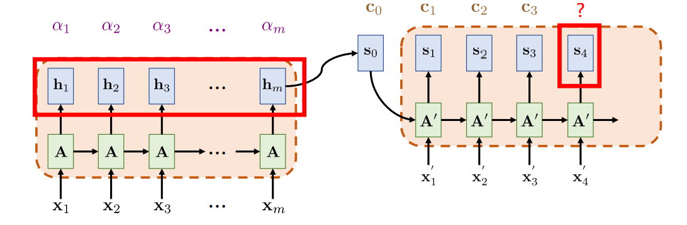

## 赛事背景

赛事背景
目前神经机器翻译技术已经取得了很大的突破，但在特定领域或行业中，由于机器翻译难以保证术语的一致性，导致翻译效果还不够理想。对于术语名词、人名地名等机器翻译不准确的结果，可以通过术语词典进行纠正，避免了混淆或歧义，最大限度提高翻译质量。

赛事任务
基于术语词典干预的机器翻译挑战赛选择以英文为源语言，中文为目标语言的机器翻译。本次大赛除英文到中文的双语数据，还提供英中对照的术语词典。参赛队伍需要基于提供的训练数据样本从多语言机器翻译模型的构建与训练，并基于测试集以及术语词典，提供最终的翻译结果。

赛题数据
- 训练集：双语数据 - 中英14万余双语句对
- 开发集：英中1000双语句对
- 测试集：英中1000双语句对
- 术语词典：英中2226条

简单说明
- 训练集（training set）用于运行你的学习算法。
- 开发集（development set）用于调整参数，选择特征，以及对学习算法作出其它决定。有时也称为留出交叉验证集（hold-out cross validation set）。
- 测试集（test set）用于评估算法的性能，但不会据此改变学习算法或参数。

评估指标
对于参赛队伍提交的测试集翻译结果文件，采用自动评价指标 BLEU-4 进行评价，具体工具使用 sacrebleu开源版本。

### 什么是 BLEU-4  ？
 BLEU，全称为Bilingual Evaluation Understudy（双语评估替换），是一种对生成语句进行评估的指标。BLEU 评分是由Kishore Papineni等人2002年的论文《BLEU: a Method for Automatic Evaluation of Machine Translation》中提出的。

在机器翻译领域，BLEU（Bilingual Evaluation Understudy）是一种常用的自动评价指标，用于衡量计算机生成的翻译与一组参考译文之间的相似度。这个指标特别关注 n-grams（连续的n个词）的精确匹配，可以被认为是对翻译准确性和流利度的一种统计估计。计算BLEU分数时，首先会统计生成文本中n-grams的频率，然后将这些频率与参考文本中的n-grams进行比较。如果生成的翻译中包含的n-grams与参考译文中出现的相同，则认为是匹配的。最终的BLEU分数是一个介于0到1之间的数值，其中1表示与参考译文完美匹配，而0则表示完全没有匹配。

BLEU-4 特别指的是在计算时考虑四元组（即连续四个词）的匹配情况。

## 基于 Seq2Seq 的 Baseline 详解
### 环境依赖

``` python
!pip install torchtext    
!pip install jieba
!pip install sacrebleu 
```

有几个包需要额外安装：
- torchtext ：是一个用于自然语言处理（NLP）任务的库，它提供了丰富的功能，包括数据预处理、词汇构建、序列化和批处理等，特别适合于文本分类、情感分析、机器翻译等任务
- jieba：是一个中文分词库，用于将中文文本切分成有意义的词语
- sacrebleu：用于评估机器翻译质量的工具，主要通过计算BLEU（Bilingual Evaluation Understudy）得分来衡量生成文本与参考译文之间的相似度

这里，我们需要安装 spacy 用于英文的 tokenizer（分词，就是将句子、段落、文章这种长文本，分解为以字词为单位的数据结构，方便后续的处理分析工作）
- spacy：是一个强大的自然语言处理库，支持70+语言的分词与训练

<div align="center">
    
</div>

需要注意的是，使用命令!python -m spacy download en_core_web_trf安装 en_core_web_sm 语言包非常的慢，经常会安装失败,因此可以离线安装 en_core_web_sm 语言包，从该路径下：https://github.com/explosion/spacy-models/releases 安装对应版本的 en_core_web_trf 语言包，可以看到我的 en_core_web_trf 3.7.3 版本的要求 spaCy >=3.7.2,<3.8.0，刚好满足我的 3.7.5的 spacy!：

<div align="center">
    
</div>

将下载到本地的压缩包上传到你的魔搭平台上的  dataset 目录下，然后使用 !pip install ../dataset/en_core_web_trf安装英文语言包：

<div align="center">
    
</div>

``` python
!pip install -U pip setuptools wheel -i https://pypi.tuna.tsinghua.edu.cn/simple
pip install -U 'spacy[cuda12x,transformers,lookups]' -i https://pypi.tuna.tsinghua.edu.cn/simple
!pip install ../dataset/en_core_web_trf-3.7.3-py3-none-any.whl
```

### 数据预处理

机器翻译任务的预处理是确保模型能够有效学习源语言到目标语言映射的关键步骤。预处理阶段通常包括多个步骤，旨在清理、标准化和转换数据，使之适合模型训练。以下是机器翻译任务预处理中常见的几个处理步骤：
- 清洗和规范化数据
  - 去除无关信息：删除HTML标签、特殊字符、非文本内容等，确保文本的纯净性（本赛题的训练集中出现了非常多的脏数据，如“Joey.        （掌声） （掌声） 乔伊”、“Thank you.        （马嘶声） 谢谢你们”等这种声音词）
  - 统一格式：转换所有文本为小写，确保一致性；标准化日期、数字等格式。
  - 分句和分段：将长文本分割成句子或段落，便于处理和训练。

- 分词
  - 分词：将句子分解成单词或词素（构成单词的基本组成部分，一个词素可以是一个完整的单词，也可以是单词的一部分，但每一个词素都至少携带一部分语义或语法信息），这是NLP中最基本的步骤之一。我们这里使用了使用jieba 对中文进行分词，使用spaCy对英文进行分词。

- 构建词汇表和词向量
  - 词汇表构建：从训练数据中收集所有出现过的词汇，构建词汇表，并为每个词分配一个唯一的索引。
  - 词向量：使用预训练的词向量或自己训练词向量，将词汇表中的词映射到高维空间中的向量，以捕捉语义信息（当前大模型领域训练的 embedding 模型就是用来完成此任务的）。

- 序列截断和填充
  - 序列截断：限制输入序列的长度，过长的序列可能增加计算成本，同时也可能包含冗余信息。
  - 序列填充：将所有序列填充至相同的长度，便于批量处理。通常使用<PAD>标记填充。

- 添加特殊标记
  - 序列开始和结束标记：在序列两端添加<SOS>（Sequence Start）和<EOS>（Sequence End）标记，帮助模型识别序列的起始和结束。
  - 未知词标记：为不在词汇表中的词添加<UNK>（Unknown）标记，使模型能够处理未见过的词汇。

- 数据增强
  - 随机替换或删除词：在训练数据中随机替换或删除一些词，增强模型的鲁棒性。
  - 同义词替换：使用同义词替换原文中的词，增加训练数据的多样性。

- 数据分割
  - 划分数据集：将数据划分为训练集、验证集和测试集，分别用于模型训练、参数调整和最终性能评估（该赛题中已划分好，不需要自己进行划分）

### 模型训练

说到神经机器翻译就不得不提编码器-解码器模型，或编码器-解码器框架（EncoderDecoder Paradigm）。本质上，编码器­解码器模型是描述输入­输出之间关系的一种方式。编码器­解码器这个概念在日常生活中并不少见。

<div align="center">
    
</div>

`给定一个中文句子“我/对/你/感到/满意”，编码器会将这句话编码成一个实数向量(0.2, −1, 6, 5, 0.7, −2)，这个向量就是源语言句子的“表示”结果。虽然有些不可思议，但是神经机器翻译模型把这个向量等同于输入序列。向量中的数字并没有实际的意义，然而解码器却能从中提取到源语言句子中所包含的信息。也有研究人员把向量的每一个维度看作是一个“特征”，这样源语言句子就被表示成多个“特征”的联合，而且这些特征可以被自动学习。有了这样的源语言句子的“表示”，解码器可以把这个实数向量作为输入，然后逐词生成目标语言句子“I am satisfied with you”。`

在源语言句子的表示形式确定之后，需要设计相应的编码器和解码器结构。在当今主流的神经机器翻译系统中，编码器由词嵌入层和中间网络层组成：
- 当输入一串单词序列时，词嵌入层(embedding)会将每个单词映射到多维实数表示空间，这个过程也被称为词嵌入。
- 之后中间层会对词嵌入向量进行更深层的抽象，得到输入单词序列的中间表示。中间层的实现方式有很多，比如：循环神经网络、卷积神经网络、自注意力机制等都是模型常用的结构。

解码器的结构基本上和编码器是一致的，在基于循环神经网络的翻译模型中，解码器只比编码器多了输出层，用于输出每个目标语言位置的单词生成概率，而在基于自注意力机制的翻译模型中，除了输出层，解码器还比编码器多一个编码­解码注意力子层，用于帮助模型更好地利用源语言信息。

通过循环网络对源语言文本进行编码，并生成目标语言翻译结果的过程十分简单。然而，它仅仅使用一个定长的向量 $$h_{m}$$ 编码整个源语言序列。这对于较短的源语言文本没有什么问题，但随着文本序列长度的逐渐加长，单一的一个向量 hm 可能不足以承载源语言序列当中的所有信息。

<div align="center">
    
</div>

蓝色的线代表上述简单循环神经网络性能随源语言文本长度的变化趋势。当文本长度在 20 个单词以内时，单一向量能够承载源语言文本中的必要信息。随着文本序列的进一步增加，翻译性能的评价指标 BLEU 的值就开始出现明显地下降。因此，这就启发我们使用更加有效地机制从编码器向解码器传递源语言信息，这就是接下来要讲到的注意力机制。

引入注意力机制的循环机器翻译架构与基于简单循环网络的机器翻译模型大体结构相似，均采用循环神经网络作为编码器与解码器的实现。关键的不同点在于注意力机制的引入使得不再需要把原始文本中的所有必要信息压缩到一个向量当中。引入注意力机制的循环神经网络机器翻译架构如图所示:

1.无注意力机制：
<br>
<div align="center">
    
</div>
<br>
2.引入注意力机制：
<br>
<div align="center">
    
</div>
<br>

传统的 Seq2Seq 模型在解码阶段仅依赖于编码器产生的最后一个隐藏状态，这在处理长序列时效果不佳。注意力机制允许解码器在生成每个输出词时，关注编码器产生的所有中间状态，从而更好地利用源序列的信息。具体来说，给定源语言序列经过编码器输出的向量序列 $$h_{1},h_{2},h_{3},...,h_{m}$$，注意力机制旨在依据解码端翻译的需要，自适应地从这个向量序列中查找对应的信息。

*baseline 代码中实现了一个经典的序列到序列(Seq2Seq)模型，中间层使用的GRU网络，并且网络中加入了注意力机制(Attention Mechanism)*

- GRU 知识讲解：https://zh.d2l.ai/chapter_recurrent-modern/gru.html

### 翻译质量评价
本世纪初研究人员提出了译文质量自动评价方法 BLEU（Bilingual Evaluation Understudy）。该方法使得机器翻译系统的评价变得自动、快速、便捷，而且评价过程可以重复。正是由于 BLEU 等自动评价方法的提出，机器翻译研究人员可以在更短的时间内得到译文质量的评价结果，加速系统研发的进程。

P.S.文中涉及到的GRU门控循环单元，与改进的基于Transformer的解决方案，都会放在本系列的其他文章中单独讲解。