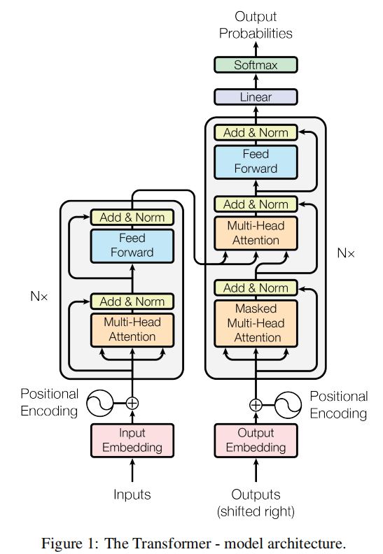
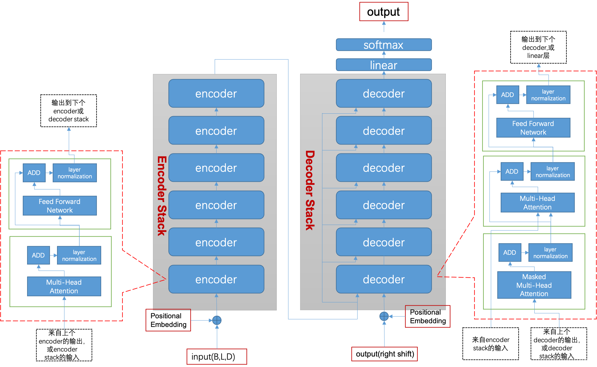
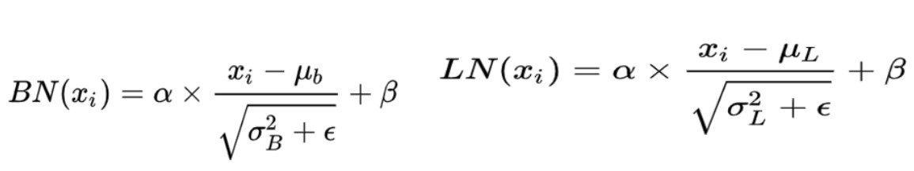
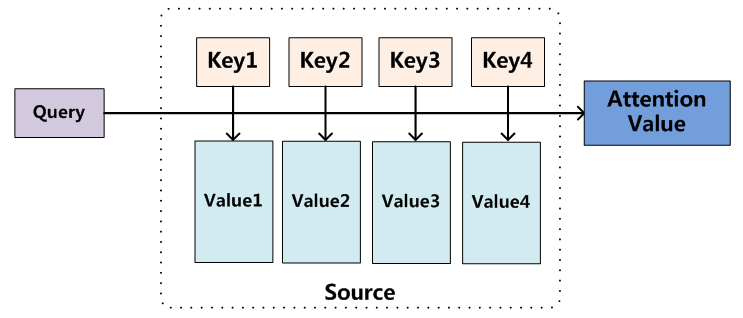
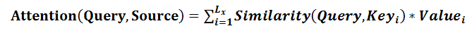
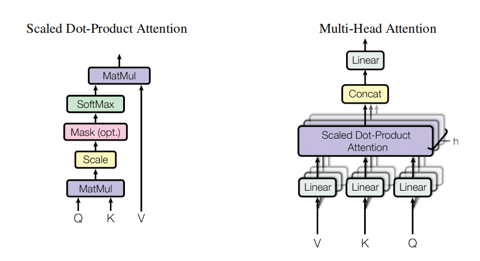

# Attention is all you need

[论文精讲](https://www.bilibili.com/video/BV1pu411o7BE/?spm_id_from=333.999.0.0&vd_source=27bfe73442d060c8d6150bb8b61d24a2)

## Transfomer架构

### 原文片段

“主流的序列转换模型都是基于复杂的循环神经网络或卷积神经网络，且都包含一个encoder和一个decoder。表现最好的模型还通过attention机制把encoder和decoder联接起来。而Transformer只基于单独的attention机制，完全避免使用循环和卷积。

encoder将符号表示的输入序列( x 1 , . . . , x n ) 映射成一个连续表示的序列z = ( z 1 , . . . , z n ) 

给定z ，解码器以一次生成一个字符的方式生成输出序列( y 1 , . . . , y m ) 。在每一步，模型都是自回归的。在生成下一个字符时，将先前生成的符号作为附加输入。

Transformer遵循这个总体架构，使用堆叠的self-attention层、point-wise和全连接层，分别用于encoder和decoder。

Encoder : encoder由N(N=6)个完全相同的layer堆叠而成，每层有两个子层。第一层是multi-head self-attention机制，第二层是一个简单的、位置全连接的前馈神经网络。我们在两个子层的每一层后采用残差连接，接着进行layer normalization。

Decoder : decoder也由N(N=6)个完全相同的layer堆叠而成。除了每个编码器层中的两个子层之外，解码器还插入第三个子层，该子层对编码器堆栈的输出执行multi-head attention操作，与encoder相似，我们在每个子层的后面使用了残差连接，之后采用了layer normalization。”

    

### Transfomer开山之作

在Transformer提出以前，主流的NLP模型包括RNN、LSTM、GRU等，这些模型是有以下缺点：

- 难以并行
- 时序中过早的信息容易被丢弃
- 内存开销大

由于这些网络都是由前往后一步步计算的，当前的状态不仅依赖当前的输入，也依赖于前一个状态的输出。即对于网络中的第个t状态，与前t-1个状态都有关，使得网络必须一步一步计算；当较为重要的信息在较早的时序中进入网络时，多次传播过程中可能保留很少甚至被丢弃；从另一角度来考虑，即使重要的信息没有被丢弃，而是随着网络继续传递，那么势必会造成内存的冗余，导致开销过大。

所以，作者团队因势利导，引出了本文纯attention、高并行、高效率的Transformer网络结构。

Transformer这种神经网络架构，其独特之处在于完全基于注意力机制，摒弃了传统的循环和卷积操作。通过自注意力机制（self-attention），Transformer能够有效捕捉输入序列中的长距离依赖关系，使得模型在处理长文本时更为高效和准确。多头注意力机制（multi-head attention）则进一步增强了模型的表达能力，使其能够同时关注输入序列中的不同部分，捕捉更加复杂的语义关系。

    

### layer norm 而不是batch norm

当我们使用梯度下降法做优化时，随着网络深度的增加，输入数据的特征分布会不断发生变化，为了保证数据特征分布的稳定性，会加入Normalization。从而可以使用更大的学习率，从而加速模型的收敛速度。同时，Normalization也有一定的抗过拟合作用，使训练过程更加平稳。具体地，Normalization的主要作用就是把每层特征输入到激活函数之前，对它们进行normalization，使其转换为均值为0，方差为1的数据，从而可以避免数据落在激活函数的饱和区，以减少梯度消失的问题。

BN（BatchNorm）和LN（LayerNorm）是两种最常用的Normalization的方法，它们都是将输入特征转换为均值为0，方差为1的数据，它们的形式是：
 

    

 
只不过，BN是对一个batch-size样本内的每个特征做归一化，LN是对每个样本的所有特征做归一化。以一个二维矩阵为例，它的行数代表batch_size，列数代表fea_nums。BN就是竖着进行归一化，LN则是横着进行归一化。

所以，BN抹平了不同特征之间的大小关系，而保留了不同样本之间的大小关系。这样，如果具体任务依赖于不同样本之间的关系，BN更有效，尤其是在CV领域，例如不同图片样本进行分类，不同样本之间的大小关系得以保留。
LN抹平了不同样本之间的大小关系，而保留了不同特征之间的大小关系。所以，LN更适合NLP领域的任务，其中，一个样本的特征实际上就是不同word embedding，通过LN可以保留特征之间的这种时序关系。

### Encoder-Decoder框架
Encoder-Decoder框架可以看作是一种深度学习领域的研究模式，应用场景异常广泛。

文本处理领域的Encoder-Decoder框架可以这么直观地去理解：可以把它看作适合处理由一个句子（或篇章）生成另外一个句子（或篇章）的通用处理模型。对于句子对<Source,Target>，我们的目标是给定输入句子Source，期待通过Encoder-Decoder框架来生成目标句子Target。

Encoder顾名思义就是对输入句子Source进行编码，将输入句子通过非线性变换转化为中间语义表示C;

对于解码器Decoder来说，其任务是根据句子Source的中间语义表示C和之前已经生成的历史信息y1,y2……yi-1来生成i时刻要生成的单词yi。

每个yi都依次这么产生，那么看起来就是整个系统根据输入句子Source生成了目标句子Target。

- 如果Source是中文句子，Target是英文句子，那么这就是解决机器翻译问题的Encoder-Decoder框架；
- 如果Source是一篇文章，Target是概括性的几句描述语句，那么这是文本摘要的Encoder-Decoder框架；
- 如果Source是一句问句，Target是一句回答，那么这是问答系统或者对话机器人的Encoder-Decoder框架。

P.S. 一般而言，文本处理和语音识别的Encoder部分通常采用RNN模型，图像处理的Encoder一般采用CNN模型。

### Attention机制

Attention 机制 3 大优点：

- 参数少
模型复杂度跟 CNN、RNN 相比，复杂度更小，参数也更少。所以对算力的要求也就更小。

- 速度快
Attention 解决了 RNN 不能并行计算的问题。Attention机制每一步计算不依赖于上一步的计算结果，因此可以和CNN一样并行处理。

- 效果好
在 Attention 机制引入之前，有一个问题大家一直很苦恼：长距离的信息会被弱化，就好像记忆能力弱的人，记不住过去的事情是一样的。
Attention 是挑重点，就算文本比较长，也能从中间抓住重点，不丢失重要的信息。下图红色的预期就是被挑出来的重点。

目前大多数注意力模型附着在Encoder-Decoder框架下，当然，其实注意力模型可以看作一种通用的思想，本身并不依赖于特定框架，这点需要注意。Attention 并不一定要在 Encoder-Decoder 框架下使用的，他是可以脱离 Encoder-Decoder 框架的。
 

    

 
将Source中的构成元素想象成是由一系列的<Key,Value>数据对构成，此时给定Target中的某个元素Query，通过计算Query和各个Key的相似性或者相关性，得到每个Key对应Value的权重系数，然后对Value进行加权求和，即得到了最终的Attention数值。所以本质上Attention机制是对Source中元素的Value值进行加权求和，而Query和Key用来计算对应Value的权重系数。即可以将其本质思想改写为如下公式：
 

    

 
在一般任务的Encoder-Decoder框架中，输入Source和输出Target内容是不一样的，比如对于英-中机器翻译来说，Source是英文句子，Target是对应的翻译出的中文句子，Attention机制发生在Target的元素Query和Source中的所有元素之间。

而**Self Attention**顾名思义，指的不是Target和Source之间的Attention机制，而是Source内部元素之间或者Target内部元素之间发生的Attention机制，也可以理解为Target=Source这种特殊情况下的注意力计算机制。其具体计算过程是一样的，只是计算对象发生了变化而已

Transformer使用的点乘注意力机制和多头注意力机制：
 

    

 
这里h=8,8个head
 

    

 

#### 编码器的注意力机制：

多头自注意力机制：
- key value query都是自己本身，一个向量和各个向量计算相似度
多头注意力块接收包含子向量（句子中的单词）的向量（句子）作为输入，然后计算每个位置与向量的所有其他位置之间的注意力。

#### 解码器的注意力机制：

Masked 多头自注意力机制：
- 用 masked 把后面的内容盖住，自注意力机制，和编码器的自注意力机制一样。

最后一个 多头注意力机制：
- 不再是自注意力，编码器的输出作为value和key进来，解码器下一层的输出作为query进来。

### Add & Norm

残差连接&归一化
就是指对新的output做标准化

- add代表残差连接（Residual Connection），旨在解决深度神经网络训练过程中的梯度消失和表示瓶颈问题。
- norm = Normalization归一化，在transformer里面，使用layer normalization。

add：残差连接，可以增加深度，不丢失初始的特征。
norm归一化，因为add把原始的特征加回来，为了避免梯度消失，减少运算，进行归一化处理。

### FeedForward

FeedForward是由全连接层（FC）与激活ReLu组成的结构

为什么要用FeedForward呢？不用单纯的FC呢？
- 主要还是想提取更深层次的特征，在Multi-Head Attention中，主要是进行矩阵乘法，即都是线性变换，而线性变换的学习能力不如非线性变换的学习能力强，我们希望通过引入ReLu激活函数，使模型增加非线性成分，强化学习能力。

