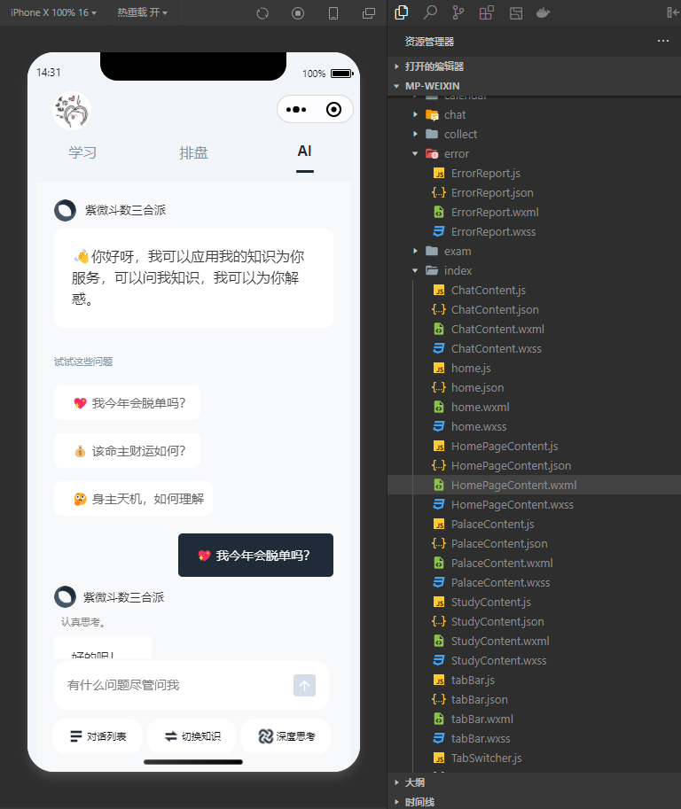

# 百无禁忌Varmeta开发日志帖

终于体验了Cursor！效果还不错！ChatGPT-4o代码生成永远的神！

可以直接把原型图和多个组件 add 到chat台，选择Claude-3.5或GPT-4o来帮忙生成回答和代码。

<br>
<div align="center">
    
</div>
<br>

<div align="center">
    
</div>
<br>


记录一个借助chatgpt-4o解决的小问题：

``` javascript

    // 发送消息后滚动到底部
    // scrollToBottom() {
    //   setTimeout(() => {
    //     const query = uni.createSelectorQuery().in(this)
    //     query.select('.scrollable-content').boundingClientRect(res => {
    //       if (res) {
    //         // 直接滚动到底部
    //         this.scrollTop = res.height // 直接设置为内容高度即可
    //       }
    //     }).exec()
    //   }, 100)
    // },
    scrollToBottom() {
      this.$nextTick(() => {
        const query = uni.createSelectorQuery().in(this)
        query.select('.scrollable-content').boundingClientRect()
        query.selectAll('.message-wrapper').boundingClientRect()
        query.exec(res => {
          if (res[1] && res[1].length > 0) {
            const lastMessage = res[1][res[1].length - 1]
            this.scrollTop = lastMessage.bottom // 滚动到最后一条消息的底部
          }
        })
      })
    },

```

需求是每次对话完，都自动滚动到聊天区域的底部，以确保用户始终可以看到最新一条对话记录。

上面注释掉的解决办法是一开始不能奏效的滚动函数，下面是改动后的函数：

- 关键点： 
1. 使用 $nextTick: 确保在 DOM 更新后再执行滚动操作。 
2. 获取最后一条消息的位置: 使用 boundingClientRect 获取最后一条消息的位置，并将 scrollTop 设置为该位置的底部。  
3. 确保 scroll-view 的 :scroll-top 绑定到 scrollTop: 确保 scroll-view 的 :scroll-top 属性正确绑定到 scrollTop 数据。  

这样，每次发送消息后，页面应该会自动滚动到最后一条消息的位置。

- 原因：

主要是由于 DOM 更新时机 和 滚动逻辑 的不同导致的：


1. 函数1：使用 setTimeout 的目的是等待 DOM 更新完成后再执行滚动逻辑。但 setTimeout 的延迟时间（100ms）是固定的，无法保证 DOM 更新一定在 100ms 内完成。如果 DOM 更新较慢，setTimeout 可能仍然在 DOM 更新前执行，导致滚动失败。
2. 函数2：$nextTick 是 Vue 提供的一个方法，用于在 下一次 DOM 更新循环结束之后 执行回调函数。使用 $nextTick 可以确保 DOM 更新完成后再执行滚动逻辑，避免了 setTimeout 的延迟不确定性。
3. 函数1直接使用容器高度，可能不准确；函数2使用最后一条消息的底部位置，更精确。


- 原理：

1. 为什么需要 $nextTick？

在 Vue 中，数据的变化会触发视图的更新，但 DOM 更新是异步的。也就是说，当你修改了数据后，Vue 并不会立即更新 DOM，而是将这些更新操作放入一个队列中，在下一个事件循环中统一处理。

如果你在数据变化后立即操作 DOM，可能会因为 DOM 还未更新而出现问题。例如：

获取不到最新的 DOM 元素、获取到的 DOM 元素尺寸或位置不准确。

$nextTick 就是为了解决这个问题而设计的。它允许你在 DOM 更新完成后执行回调函数，确保操作的是最新的 DOM。

2. $nextTick 的工作原理

当你调用 $nextTick 时，Vue 会将传入的回调函数放入一个队列中。

在当前事件循环中，Vue 会处理所有的数据更新和 DOM 更新。

当 DOM 更新完成后，Vue 会执行队列中的回调函数。

3. $nextTick 的使用方法

$nextTick 可以作为一个实例方法（this.$nextTick）或全局方法（Vue.nextTick）使用。

4. $nextTick 的返回值
$nextTick 返回一个 Promise 对象，因此你可以使用 async/await 语法。


- 总结：

$nextTick 是 Vue 提供的一个用于在 DOM 更新完成后执行回调函数的方法。

它解决了因 DOM 更新异步性导致的操作不一致问题。

适用于需要操作更新后的 DOM、获取更新后的 DOM 尺寸或位置等场景。

与 setTimeout 相比，$nextTick 更精确、更高效。