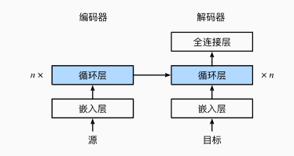
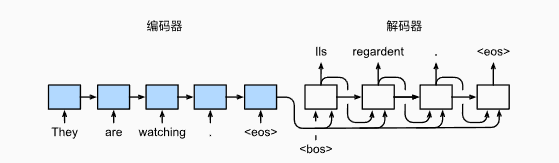

## Seq2Seq架构

baseline 代码中实现了一个经典的序列到序列(Seq2Seq)模型，中间层使用的GRU网络，并且网络中加入了注意力机制(Attention Mechanism)

编码器将长度可变的输入序列转换成 形状固定的上下文变量， 并且将输入序列的信息在该上下文变量中进行编码。

让我们实现循环神经网络编码器。 注意，我们使用了嵌入层（embedding layer） 来获得输入序列中每个词元的特征向量。 嵌入层的权重是一个矩阵， 其行数等于输入词表的大小（vocab_size）， 其列数等于特征向量的维度（embed_size）。 对于任意输入词元的索引 i ， 嵌入层获取权重矩阵的第 i 行（从0开始）以返回其特征向量。 另外，本文选择了一个多层门控循环单元来实现编码器。

``` python
class Seq2SeqEncoder(d2l.Encoder):
    """用于序列到序列学习的循环神经网络编码器"""
    def __init__(self, vocab_size, embed_size, num_hiddens, num_layers,
                 dropout=0, **kwargs):
        super(Seq2SeqEncoder, self).__init__(**kwargs)
        # 嵌入层
        self.embedding = nn.Embedding(vocab_size, embed_size)
        self.rnn = nn.GRU(embed_size, num_hiddens, num_layers,
                          dropout=dropout)

    def forward(self, X, *args):
        # 输出'X'的形状：(batch_size,num_steps,embed_size)
        X = self.embedding(X)
        # 在循环神经网络模型中，第一个轴对应于时间步
        X = X.permute(1, 0, 2)
        # 如果未提及状态，则默认为0
        output, state = self.rnn(X)
        # output的形状:(num_steps,batch_size,num_hiddens)
        # state的形状:(num_layers,batch_size,num_hiddens)
        return output, state
```

下面，我们实例化上述编码器的实现： 我们使用一个两层门控循环单元编码器，其隐藏单元数为16。 给定一小批量的输入序列X（批量大小为4，时间步为7）。 在完成所有时间步后， 最后一层的隐状态的输出是一个张量（output由编码器的循环层返回）， 其形状为（时间步数，批量大小，隐藏单元数）。

``` python
encoder = Seq2SeqEncoder(vocab_size=10, embed_size=8, num_hiddens=16,
                         num_layers=2)
encoder.eval()
X = torch.zeros((4, 7), dtype=torch.long)
output, state = encoder(X)
output.shape

```

`
torch.Size([7, 4, 16])
`

由于这里使用的是门控循环单元， 所以在最后一个时间步的多层隐状态的形状是 （隐藏层的数量，批量大小，隐藏单元的数量）。 如果使用长短期记忆网络，state中还将包含记忆单元信息。

``` python

state.shape

```

`
torch.Size([2, 4, 16])
`

当实现解码器时， 我们直接使用编码器最后一个时间步的隐状态来初始化解码器的隐状态。 这就要求使用循环神经网络实现的编码器和解码器具有相同数量的层和隐藏单元。 为了进一步包含经过编码的输入序列的信息， 上下文变量在所有的时间步与解码器的输入进行拼接（concatenate）。 为了预测输出词元的概率分布， 在循环神经网络解码器的最后一层使用全连接层来变换隐状态。

``` python
class Seq2SeqDecoder(d2l.Decoder):
    """用于序列到序列学习的循环神经网络解码器"""
    def __init__(self, vocab_size, embed_size, num_hiddens, num_layers,
                 dropout=0, **kwargs):
        super(Seq2SeqDecoder, self).__init__(**kwargs)
        self.embedding = nn.Embedding(vocab_size, embed_size)
        self.rnn = nn.GRU(embed_size + num_hiddens, num_hiddens, num_layers,
                          dropout=dropout)
        self.dense = nn.Linear(num_hiddens, vocab_size)

    def init_state(self, enc_outputs, *args):
        return enc_outputs[1]

    def forward(self, X, state):
        # 输出'X'的形状：(batch_size,num_steps,embed_size)
        X = self.embedding(X).permute(1, 0, 2)
        # 广播context，使其具有与X相同的num_steps
        context = state[-1].repeat(X.shape[0], 1, 1)
        X_and_context = torch.cat((X, context), 2)
        output, state = self.rnn(X_and_context, state)
        output = self.dense(output).permute(1, 0, 2)
        # output的形状:(batch_size,num_steps,vocab_size)
        # state的形状:(num_layers,batch_size,num_hiddens)
        return output, state
```

下面，我们用与前面提到的编码器中相同的超参数来实例化解码器。 如我们所见，解码器的输出形状变为（批量大小，时间步数，词表大小）， 其中张量的最后一个维度存储预测的词元分布。

``` python
decoder = Seq2SeqDecoder(vocab_size=10, embed_size=8, num_hiddens=16,
                         num_layers=2)
decoder.eval()
state = decoder.init_state(encoder(X))
output, state = decoder(X, state)
output.shape, state.shape
```

`
(torch.Size([4, 7, 10]), torch.Size([2, 4, 16]))
`

上述循环神经网络“编码器－解码器”模型中的各层如:

<br>
<div align="center">
    
</div>
<br>

在每个时间步，解码器预测了输出词元的概率分布。 类似于语言模型，可以使用softmax来获得分布， 并通过计算交叉熵损失函数来进行优化。
特定的填充词元被添加到序列的末尾， 因此不同长度的序列可以以相同形状的小批量加载。 但是，我们应该将填充词元的预测排除在损失函数的计算之外。
为此，我们可以使用下面的sequence_mask函数 通过零值化屏蔽不相关的项， 以便后面任何不相关预测的计算都是与零的乘积，结果都等于零。 例如，如果两个序列的有效长度（不包括填充词元）分别为1和2， 则第一个序列的第一项和第二个序列的前两项之后的剩余项将被清除为零。

``` python
def sequence_mask(X, valid_len, value=0):
    """在序列中屏蔽不相关的项"""
    maxlen = X.size(1)
    mask = torch.arange((maxlen), dtype=torch.float32,
                        device=X.device)[None, :] < valid_len[:, None]
    X[~mask] = value
    return X

X = torch.tensor([[1, 2, 3], [4, 5, 6]])
sequence_mask(X, torch.tensor([1, 2]))
```

`
tensor([[1, 0, 0],
        [4, 5, 0]])
`

我们还可以使用此函数屏蔽最后几个轴上的所有项。如果愿意，也可以使用指定的非零值来替换这些项。

``` python
X = torch.ones(2, 3, 4)
sequence_mask(X, torch.tensor([1, 2]), value=-1)
```

`
tensor([[[ 1.,  1.,  1.,  1.],
         [-1., -1., -1., -1.],
         [-1., -1., -1., -1.]],

        [[ 1.,  1.,  1.,  1.],
         [ 1.,  1.,  1.,  1.],
         [-1., -1., -1., -1.]]])
`

现在，我们可以通过扩展softmax交叉熵损失函数来遮蔽不相关的预测。 最初，所有预测词元的掩码都设置为1。 一旦给定了有效长度，与填充词元对应的掩码将被设置为0。 最后，将所有词元的损失乘以掩码，以过滤掉损失中填充词元产生的不相关预测。

``` python
class MaskedSoftmaxCELoss(nn.CrossEntropyLoss):
    """带遮蔽的softmax交叉熵损失函数"""
    # pred的形状：(batch_size,num_steps,vocab_size)
    # label的形状：(batch_size,num_steps)
    # valid_len的形状：(batch_size,)
    def forward(self, pred, label, valid_len):
        weights = torch.ones_like(label)
        weights = sequence_mask(weights, valid_len)
        self.reduction='none'
        unweighted_loss = super(MaskedSoftmaxCELoss, self).forward(
            pred.permute(0, 2, 1), label)
        weighted_loss = (unweighted_loss * weights).mean(dim=1)
        return weighted_loss
```

我们可以创建三个相同的序列来进行代码健全性检查， 然后分别指定这些序列的有效长度为4、2和0。 结果就是，第一个序列的损失应为第二个序列的两倍，而第三个序列的损失应为零。

``` python
loss = MaskedSoftmaxCELoss()
loss(torch.ones(3, 4, 10), torch.ones((3, 4), dtype=torch.long),
     torch.tensor([4, 2, 0]))
```

`tensor([2.3026, 1.1513, 0.0000])`

在下面的循环训练过程中，特定的序列开始词元（“<bos>”）和 原始的输出序列（不包括序列结束词元“<eos>”） 拼接在一起作为解码器的输入。 这被称为强制教学（teacher forcing）， 因为原始的输出序列（词元的标签）被送入解码器。 或者，将来自上一个时间步的预测得到的词元作为解码器的当前输入。

``` python
def train_seq2seq(net, data_iter, lr, num_epochs, tgt_vocab, device):
    """训练序列到序列模型"""
    def xavier_init_weights(m):
        if type(m) == nn.Linear:
            nn.init.xavier_uniform_(m.weight)
        if type(m) == nn.GRU:
            for param in m._flat_weights_names:
                if "weight" in param:
                    nn.init.xavier_uniform_(m._parameters[param])

    net.apply(xavier_init_weights)
    net.to(device)
    optimizer = torch.optim.Adam(net.parameters(), lr=lr)
    loss = MaskedSoftmaxCELoss()
    net.train()
    animator = d2l.Animator(xlabel='epoch', ylabel='loss',
                     xlim=[10, num_epochs])
    for epoch in range(num_epochs):
        timer = d2l.Timer()
        metric = d2l.Accumulator(2)  # 训练损失总和，词元数量
        for batch in data_iter:
            optimizer.zero_grad()
            X, X_valid_len, Y, Y_valid_len = [x.to(device) for x in batch]
            bos = torch.tensor([tgt_vocab['<bos>']] * Y.shape[0],
                          device=device).reshape(-1, 1)
            dec_input = torch.cat([bos, Y[:, :-1]], 1)  # 强制教学
            Y_hat, _ = net(X, dec_input, X_valid_len)
            l = loss(Y_hat, Y, Y_valid_len)
            l.sum().backward()      # 损失函数的标量进行“反向传播”
            d2l.grad_clipping(net, 1)
            num_tokens = Y_valid_len.sum()
            optimizer.step()
            with torch.no_grad():
                metric.add(l.sum(), num_tokens)
        if (epoch + 1) % 10 == 0:
            animator.add(epoch + 1, (metric[0] / metric[1],))
    print(f'loss {metric[0] / metric[1]:.3f}, {metric[1] / timer.stop():.1f} '
        f'tokens/sec on {str(device)}')
```

现在，在机器翻译数据集上，我们可以 创建和训练一个循环神经网络“编码器－解码器”模型用于序列到序列的学习。
``` python
embed_size, num_hiddens, num_layers, dropout = 32, 32, 2, 0.1
batch_size, num_steps = 64, 10
lr, num_epochs, device = 0.005, 300, d2l.try_gpu()

train_iter, src_vocab, tgt_vocab = d2l.load_data_nmt(batch_size, num_steps)
encoder = Seq2SeqEncoder(len(src_vocab), embed_size, num_hiddens, num_layers,
                        dropout)
decoder = Seq2SeqDecoder(len(tgt_vocab), embed_size, num_hiddens, num_layers,
                        dropout)
net = d2l.EncoderDecoder(encoder, decoder)
train_seq2seq(net, train_iter, lr, num_epochs, tgt_vocab, device)
```

为了采用一个接着一个词元的方式预测输出序列， 每个解码器当前时间步的输入都将来自于前一时间步的预测词元。 与训练类似，序列开始词元（“<bos>”） 在初始时间步被输入到解码器中。 该预测过程如 图所示， 当输出序列的预测遇到序列结束词元（“<eos>”）时，预测就结束了。


<br>
<div align="center">
    
</div>
<br>

``` python
def predict_seq2seq(net, src_sentence, src_vocab, tgt_vocab, num_steps,
                    device, save_attention_weights=False):
    """序列到序列模型的预测"""
    # 在预测时将net设置为评估模式
    net.eval()
    src_tokens = src_vocab[src_sentence.lower().split(' ')] + [
        src_vocab['<eos>']]
    enc_valid_len = torch.tensor([len(src_tokens)], device=device)
    src_tokens = d2l.truncate_pad(src_tokens, num_steps, src_vocab['<pad>'])
    # 添加批量轴
    enc_X = torch.unsqueeze(
        torch.tensor(src_tokens, dtype=torch.long, device=device), dim=0)
    enc_outputs = net.encoder(enc_X, enc_valid_len)
    dec_state = net.decoder.init_state(enc_outputs, enc_valid_len)
    # 添加批量轴
    dec_X = torch.unsqueeze(torch.tensor(
        [tgt_vocab['<bos>']], dtype=torch.long, device=device), dim=0)
    output_seq, attention_weight_seq = [], []
    for _ in range(num_steps):
        Y, dec_state = net.decoder(dec_X, dec_state)
        # 我们使用具有预测最高可能性的词元，作为解码器在下一时间步的输入
        dec_X = Y.argmax(dim=2)
        pred = dec_X.squeeze(dim=0).type(torch.int32).item()
        # 保存注意力权重（稍后讨论）
        if save_attention_weights:
            attention_weight_seq.append(net.decoder.attention_weights)
        # 一旦序列结束词元被预测，输出序列的生成就完成了
        if pred == tgt_vocab['<eos>']:
            break
        output_seq.append(pred)
    return ' '.join(tgt_vocab.to_tokens(output_seq)), attention_weight_seq
```

BLUE的计算代码如下
``` python
def bleu(pred_seq, label_seq, k):  #@save
    """计算BLEU"""
    pred_tokens, label_tokens = pred_seq.split(' '), label_seq.split(' ')
    len_pred, len_label = len(pred_tokens), len(label_tokens)
    score = math.exp(min(0, 1 - len_label / len_pred))
    for n in range(1, k + 1):
        num_matches, label_subs = 0, collections.defaultdict(int)
        for i in range(len_label - n + 1):
            label_subs[' '.join(label_tokens[i: i + n])] += 1
        for i in range(len_pred - n + 1):
            if label_subs[' '.join(pred_tokens[i: i + n])] > 0:
                num_matches += 1
                label_subs[' '.join(pred_tokens[i: i + n])] -= 1
        score *= math.pow(num_matches / (len_pred - n + 1), math.pow(0.5, n))
    return score
```

最后，利用训练好的循环神经网络“编码器－解码器”模型， 将几个英语句子翻译成法语，并计算BLEU的最终结果。

``` python
engs = ['go .', "i lost .", 'he\'s calm .', 'i\'m home .']
fras = ['va !', 'j\'ai perdu .', 'il est calme .', 'je suis chez moi .']
for eng, fra in zip(engs, fras):
    translation, attention_weight_seq = predict_seq2seq(
        net, eng, src_vocab, tgt_vocab, num_steps, device)
    print(f'{eng} => {translation}, bleu {bleu(translation, fra, k=2):.3f}')
```

`
go . => va !, bleu 1.000
i lost . => j'ai perdu ., bleu 1.000
he's calm . => il est riche ., bleu 0.658
i'm home . => je suis en retard ?, bleu 0.447
`

### Seq2Seq 小结

- 根据“编码器-解码器”架构的设计， 我们可以使用两个循环神经网络来设计一个序列到序列学习的模型。

- 在实现编码器和解码器时，我们可以使用多层循环神经网络。

- 我们可以使用遮蔽来过滤不相关的计算，例如在计算损失时。

- 在“编码器－解码器”训练中，强制教学方法将原始输出序列（而非预测结果）输入解码器。

- BLEU是一种常用的评估方法，它通过测量预测序列和标签序列之间的n元语法的匹配度来评估预测。

### Transformer

Transformer架构与论文精讲已经在前面的文章中阐述过了。

基于循环或卷积神经网络的序列到序列建模方法是现存机器翻译任务中的经典方法。然而，它们在建模文本长程依赖方面都存在一定的局限性。

- 对于卷积神经网络来说，受限的上下文窗口在建模长文本方面天然地存在不足。如果要对长距离依赖进行描述，需要多层卷积操作，而且不同层之间信息传递也可能有损失，这些都限制了模型的能力。
- 而对于循环神经网络来说，上下文的语义依赖是通过维护循环单元中的隐状态实现的。在编码过程中，每一个时间步的输入建模都涉及到对隐藏状态的修改。随着序列长度的增加，编码在隐藏状态中的序列早期的上下文信息被逐渐遗忘。尽管注意力机制的引入在一定程度上缓解了这个问题，但循环网络在编码效率方面仍存在很大的不足之处。由于编码端和解码端的每一个时间步的隐藏状态都依赖于前一时间步的计算结果，这就造成了在训练和推断阶段的低效。
- 为了更好地描述文字序列，谷歌的研究人员在 2017 年提出了一种新的模型 Transformer。

Transformer 在原论文中第一次提出就是将其应用到机器翻译领域，它的出现使得机器翻译的性能和效率迈向了一个新的阶段。它摒弃了循环结构，并完全通过注意力机制完成对源语言序列和目标语言序列全局依赖的建模。在抽取每个单词的上下文特征时，Transformer 通过自注意力机制（self-attention）衡量上下文中每一个单词对当前单词的重要程度。在这个过程当中没有任何的循环单元参与计算。这种高度可并行化的编码过程使得模型的运行变得十分高效。

Transformer的主要组件包括编码器(Encoder)、解码器(Decoder)和注意力层。其核心是利用多头自注意力机制（Multi-Head Self-Attention），使每个位置的表示不仅依赖于当前位置，还能够直接获取其他位置的表示。自从提出以来，Transformer模型在机器翻译、文本生成等自然语言处理任务中均取得了突破性进展，成为NLP领域新的主流模型。

从宏观角度来看，Transformer的编码器是由多个相同的层叠加而成的，每个层都有两个子层（子层表示为sublayer）。第⼀个子层是多头自注意力（multi-head self-attention）汇聚；第二个子层是基于位置的前馈网络（positionwise feed-forward network）。

``` python
# 位置编码
class PositionalEncoding(nn.Module):
    def __init__(self, d_model, dropout=0.1, max_len=5000):
        super(PositionalEncoding, self).__init__()
        self.dropout = nn.Dropout(p=dropout)

        pe = torch.zeros(max_len, d_model)
        position = torch.arange(0, max_len, dtype=torch.float).unsqueeze(1)
        div_term = torch.exp(torch.arange(0, d_model, 2).float() * (-math.log(10000.0) / d_model))
        pe[:, 0::2] = torch.sin(position * div_term)
        pe[:, 1::2] = torch.cos(position * div_term)
        pe = pe.unsqueeze(0).transpose(0, 1)
        self.register_buffer('pe', pe)

    def forward(self, x):
        x = x + self.pe[:x.size(0), :]
        return self.dropout(x)

# Transformer
class TransformerModel(nn.Module):
    def __init__(self, src_vocab, tgt_vocab, d_model, nhead, num_encoder_layers, num_decoder_layers, dim_feedforward, dropout):
        super(TransformerModel, self).__init__()
        self.transformer = nn.Transformer(d_model, nhead, num_encoder_layers, num_decoder_layers, dim_feedforward, dropout)
        self.src_embedding = nn.Embedding(len(src_vocab), d_model)
        self.tgt_embedding = nn.Embedding(len(tgt_vocab), d_model)
        self.positional_encoding = PositionalEncoding(d_model, dropout)
        self.fc_out = nn.Linear(d_model, len(tgt_vocab))
        self.src_vocab = src_vocab
        self.tgt_vocab = tgt_vocab
        self.d_model = d_model

    def forward(self, src, tgt):
        # 调整src和tgt的维度
        src = src.transpose(0, 1)  # (seq_len, batch_size)
        tgt = tgt.transpose(0, 1)  # (seq_len, batch_size)

        src_mask = self.transformer.generate_square_subsequent_mask(src.size(0)).to(src.device)
        tgt_mask = self.transformer.generate_square_subsequent_mask(tgt.size(0)).to(tgt.device)

        src_padding_mask = (src == self.src_vocab['<pad>']).transpose(0, 1)
        tgt_padding_mask = (tgt == self.tgt_vocab['<pad>']).transpose(0, 1)

        src_embedded = self.positional_encoding(self.src_embedding(src) * math.sqrt(self.d_model))
        tgt_embedded = self.positional_encoding(self.tgt_embedding(tgt) * math.sqrt(self.d_model))

        output = self.transformer(src_embedded, tgt_embedded,
                                  src_mask, tgt_mask, None, src_padding_mask, tgt_padding_mask, src_padding_mask)
        return self.fc_out(output).transpose(0, 1)
```

### 上分技巧

- 最简单的就是调参，将 epochs 调大一点，使用全部训练集，以及调整模型的参数，如head、layers等。如果数据量允许，增加模型的深度（更多的编码器/解码器层）或宽度（更大的隐藏层尺寸），这通常可以提高模型的表达能力和翻译质量，尤其是在处理复杂或专业内容时。
- 加入术语词典，这是在此竞赛中比较有效的方法，加入术语词典的方法策略也有很多，如：
  - 在模型生成的翻译输出中替换术语，这是最简单的方法
  - 整合到数据预处理流程，确保它们在翻译中保持一致
  - 在模型内部动态地调整术语的嵌入，这涉及到在模型中加入一个额外的层，该层负责查找术语词典中的术语，并为其生成专门的嵌入向量，然后将这些向量与常规的词嵌入结合使用
- 认真做数据清洗

- 数据扩增：
  - 回译（back-translation）：将源语言文本先翻译成目标语言，再将目标语言文本翻译回源语言，生成的新文本作为额外的训练数据
  - 同义词替换：随机选择句子中的词，并用其同义词替换
  - 使用句法分析和语义解析技术重新表述句子，保持原意不变
  - 将文本翻译成多种语言后再翻译回原语言，以获得多样化翻译
- 采用更精细的学习率调度策略（baseline我们使用的是固定学习率）：
  - Noam Scheduler：结合了warmup（预热）阶段和衰减阶段
  - Step Decay：最简单的一种学习率衰减策略，每隔一定数量的epoch，学习率按固定比例衰减
  - Cosine Annealing：学习率随周期性变化，通常从初始值下降到接近零，然后再逐渐上升

- 集成学习：训练多个不同初始化或架构的模型，并使用集成方法（如投票或平均）来产生最终翻译。这可以减少单一模型的过拟合风险，提高翻译的稳定性。