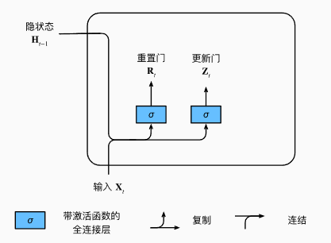
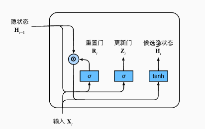
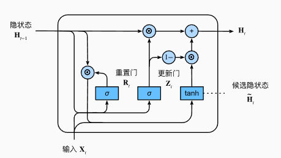

## GRU 门控循环单元

- 早期观测值对预测所有未来观测值具有非常重要的意义。我们希望有某些机制能够在一个记忆元里存储重要的早期信息。 如果没有这样的机制，我们将不得不给这个观测值指定一个非常大的梯度， 因为它会影响所有后续的观测值。
- 一些词元没有相关的观测值。我们希望有一些机制来跳过隐状态表示中的此类词元。
- 序列的各个部分之间存在逻辑中断。在这种情况下，最好有一种方法来重置我们的内部状态表示。

在学术界已经提出了许多方法来解决这类问题。 其中最早的方法是“长短期记忆”（long-short-term memory，LSTM） (Hochreiter and Schmidhuber, 1997)， 
门控循环单元（gated recurrent unit，GRU） (Cho et al., 2014) 是一个稍微简化的变体，通常能够提供同等的效果， 并且计算 (Chung et al., 2014)的速度明显更快。 由于门控循环单元更简单，我们从它开始解读。

门控循环单元与普通的循环神经网络之间的关键区别在于： 前者支持隐状态的门控。 这意味着模型有专门的机制来确定应该何时更新隐状态， 以及应该何时重置隐状态。 这些机制是可学习的，并且能够解决了上面列出的问题。 例如，如果第一个词元非常重要， 模型将学会在第一次观测之后不更新隐状态。 同样，模型也可以学会跳过不相关的临时观测。 最后，模型还将学会在需要的时候重置隐状态。 下面我们将详细讨论各类门控。

我们首先介绍重置门（reset gate）和更新门（update gate）。 我们把它们设计成（0，1）区间中的向量， 这样我们就可以进行凸组合。 重置门允许我们控制“可能还想记住”的过去状态的数量； 更新门将允许我们控制新状态中有多少个是旧状态的副本。

我们从构造这些门控开始。 图9.1.1 描述了门控循环单元中的重置门和更新门的输入， 输入是由当前时间步的输入和前一时间步的隐状态给出。 两个门的输出是由使用sigmoid激活函数的两个全连接层给出。

 

    

 

 

    

 

 

    

 

总之，门控循环单元具有以下两个显著特征：

- 重置门有助于捕获序列中的短期依赖关系；

- 更新门有助于捕获序列中的长期依赖关系。

### 小结
- 门控循环神经网络可以更好地捕获时间步距离很长的序列上的依赖关系。

- 重置门有助于捕获序列中的短期依赖关系。

- 更新门有助于捕获序列中的长期依赖关系。

- 重置门打开时，门控循环单元包含基本循环神经网络；更新门打开时，门控循环单元可以跳过子序列。